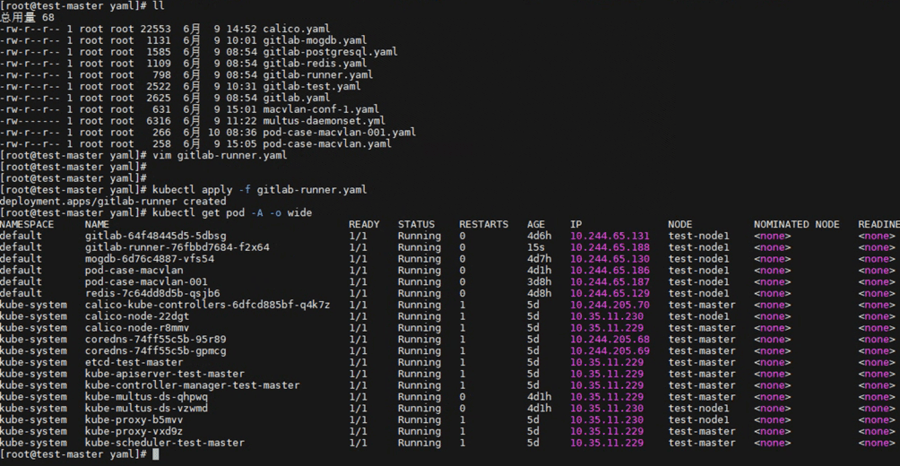
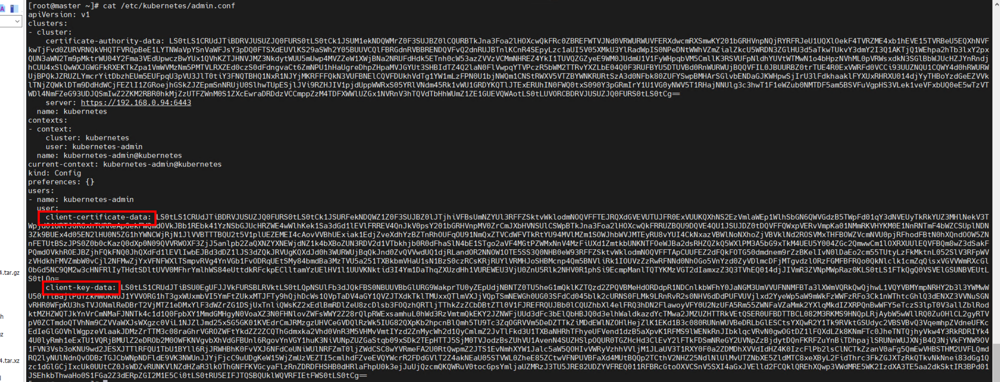
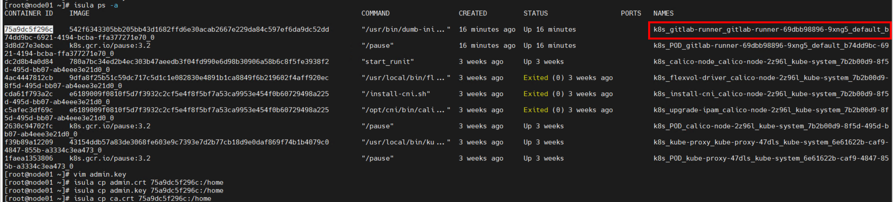
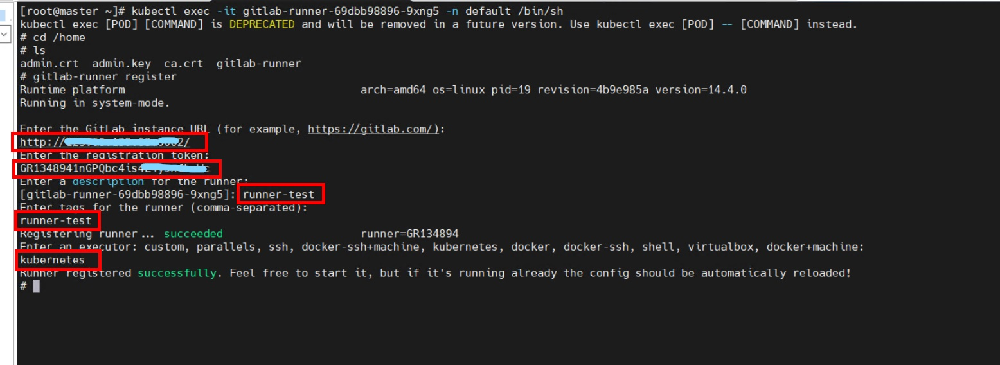
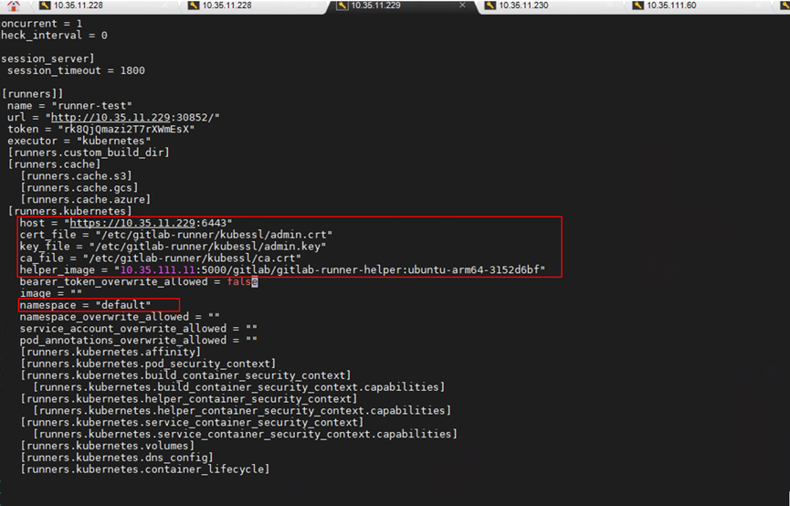
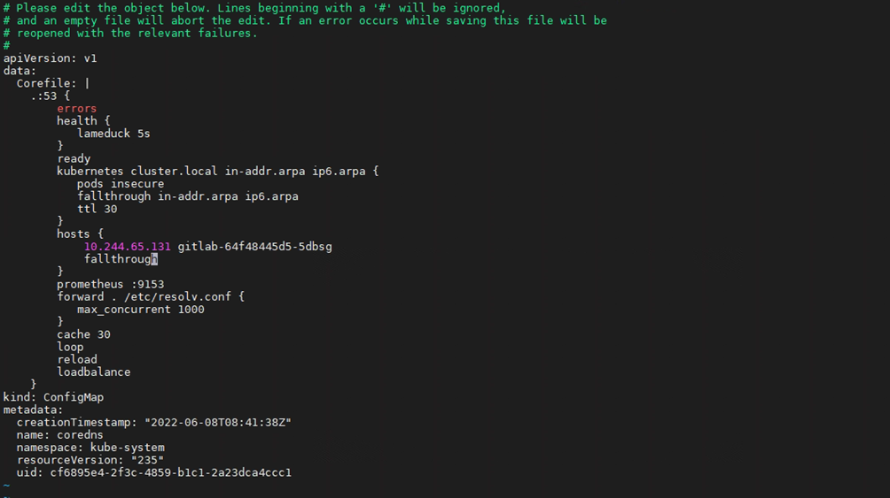
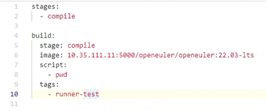

# GitLab Runner Deployment and Testing

## Images and Software

The following table lists the images required during installation. The version numbers are for reference only.

| Image                                | Version     |
|------------------------------------|----------|
| gitlab/gitlab-runner               | alpine-v14.4.0  |
| gitlab/gitlab-runner-helper        | x86_64-54944146  |

> If the Internet is unavailable in the environment, download the required images in advance.
> Download the images from the Docker Hub official website <https://hub.docker.com>.

## Using gitlab-runner.yaml to Start the Runner Container

In the **gitlab-runner.yaml** file, change the image name. The following is an example of the **.yaml** file. Modify the file as required.

```shell
vim gitlab-runner.yaml
```

```yaml
apiVersion: apps/v1
kind: Deployment
metadata:
  name: gitlab-runner
  namespace: default
spec:
  replicas: 1
  selector:
    matchLabels:
      name: gitlab-runner
  template:
    metadata:
      labels:
        name: gitlab-runner
    spec:
      containers:
      - args:
        - run
        image: gitlab/gitlab-runner:alpine-v14.4.0
        imagePullPolicy: IfNotPresent
        name: gitlab-runner
        volumeMounts:
        - mountPath: /etc/gitlab-runner
          name: config
          readOnly: false
        - mountPath: /etc/ssl/certs
          name: cacerts
          readOnly: true
      restartPolicy: Always
      volumes:
      - hostPath:
          path: /etc/gitlab-runner
        name: config
      - hostPath:
          path: /etc/ssl/key
        name: cacerts

```shell

Start the container.

```shell
# kubectl apply -f gitlab-runner.yaml
# kubectl get pod -A -o wide
```



## Creating a Container Project That Uses User Certificates for Authentication in GitLab

1. Click **New project**.

2. Select **Create blank project**.

3. Enter a name for the project.

4. Choose **Settings** > **CI/CD** > **Runners** > **Expand**.

5. Record the address and token for registering the Runner.

6. Import certificate files.

    Check and generate certificate files **admin.crt**, **admin.key**, and **ca.crt** on the master node.

    - View certificate information.

        ```shell
        # cat /etc/kubernetes/admin.conf
        ```

     

    - Generate the encrypted **admin.crt**.

        ```shell
        # echo "${client-certificate-data}" | base64 -d > admin.crt
        ```

    - Generate the encrypted **admin.key**.

        ```shell
        # echo "${client-key-data}" | base64 -d > admin.key
        ```

    - Obtain the CA certificate on the manager node.

        ```shell
        # cp /etc/kubernetes/pki/ca.crt ./
        ```

7. Import the three certificate files to the GitLab Runner container on the node where the Runner is running.

    > **Note**: To import the certificate files, check the node where the GitLab Runner is running, copy the certificate files to the node, and run the **isula cp** command to import the certificate files.

    ```shell
    # isula cp admin.crt [Container ID]:Storage path
    # isula cp admin.key [Container ID]:Storage path
    # isula cp ca.crt [Container ID]:Storage path
    ```

    Note: The **isula cp** command can copy only one file at a time.

    

## Registering the GitLab Runner

Perform registration in the GitLab Runner container. Currently, interactive registration is used. Obtain the registration information from GitLab. Choose **GitLab** > **Group runners** > **Settings** > **CI/CD** > **Runners**.



Upload the prepared **gitlab-runner-helper** image to the private image repository in advance, go to the GitLab Runner container, and modify the configuration file.

```shell
# cd /etc/gitlab-runner
# mkdir kubessl
# cp /home/admin.crt /etc/gitlab-runner/kubessl
# cp /home/ca.crt /etc/gitlab-runner/kubessl
# cp /home/admin.key /etc/gitlab-runner/kubessl
# vim /etc/gitlab-runner/config.toml
```



## Adding the DNS Record of the GitLab Container to the Manager Node

1. View the IP address of the GitLab container.

    ```shell
    # kubectl get pods -Aowide
    ```

2. Add the IP address of the GitLab container to the Kubernetes DNS configuration file.

    ```shell
    # kubectl edit configmaps coredns -n kube-system
    ```

    

3. Restart the CoreDNS service.

    ```shell
    # kubectl scale deployment coredns -n kube-system --replicas=0
    # kubectl scale deployment coredns -n kube-system --replicas=2
    ```

## GitLab Running Testing

Return to the GitLab web IDE and choose **CI/CD** > **Editor** > **Create new CI/CD pipeline**.

- Compile the YAML file as follows:



- Choose **Pipelines** and view the status.
