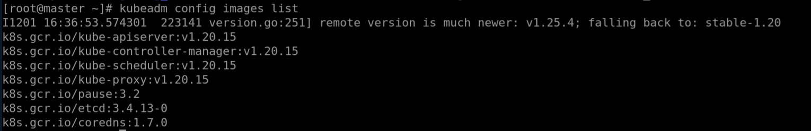

# iSulad+Kubernetes Environment Deployment

## Preparing Cluster Servers

Prepare at least 3 machines running openEuler 20.03 LTS or later versions. The following table lists information about the machines.

| Host Name | IP Address          | OS                 | Role      | Component       |
|-------|-------------|------------------------|----------|-----------|
| lab1  | 197.xxx.xxx.xxx | openEuler 20.03 LTS SP3 | Control node  | iSulad/Kubernetes |
| lab2  | 197.xxx.xxx.xxx | openEuler 20.03 LTS SP3 | Worker node 1 | iSulad/Kubernetes |
| lab3  | 197.xxx.xxx.xxx | openEuler 20.03 LTS SP3 | Worker node 2 | iSulad/Kubernetes |

## Preparing Images and Software Packages

The following table lists software packages and images used in the example. The versions are for reference only.

| Software                               | Version     |
|------------------------------------|----------|
| iSulad                             | 2.0.17-2 |
| kubernetes-client                  | 1.20.2-9 |
| kubernetes-kubeadm                 | 1.20.2-9 |
| kubernetes-kubelet                 | 1.20.2-9 |

| Image                               | Version     |
|------------------------------------|----------|
| k8s.gcr.io/kube-proxy              | v1.20.2  |
| k8s.gcr.io/kube-apiserver          | v1.20.2  |
| k8s.gcr.io/kube-controller-manager | v1.20.2  |
| k8s.gcr.io/kube-scheduler          | v1.20.2  |
| k8s.gcr.io/etcd                    | 3.4.13-0 |
| k8s.gcr.io/coredns                 | 1.7.0    |
| k8s.gcr.io/pause                   | 3.2      |
| calico/node                        | v3.14.2  |
| calico/pod2daemon-flexvol          | v3.14.2  |
| calico/cni                         | v3.14.2  |
| calico/kube-controllers            | v3.14.2  |

> If you perform the deployment in without an Internet connection, download the software packages, dependencies, and images in advance.

- Download software packages: <https://dl-cdn.openeuler.openatom.cn/>
- Download images from Docker Hub: <https://hub.docker.com>

## Modifying the hosts File

1. Change the host name of the machine, for example, **lab1**.

    ```shell
    hostnamectl set-hostname lab1
    sudo -i
    ```

2. Configure host name resolution by modifying the **/etc/hosts** file on each machine.

    ```shell
    vim /etc/hosts
    ```

3. Add the following content (IP address and host name) to the **hosts** file:

    ```text
    197.xxx.xxx.xxx lab1
    197.xxx.xxx.xxx lab2
    197.xxx.xxx.xxx lab3
    ```

## Preparing the Environment

1. Disable the firewall/

    ```shell
    systemctl stop firewalld
    systemctl disable firewalld
    ```

2. Disable SELinux.

    ```shell
    setenforce 0
    ```

3. Disable memory swapping.

    ```shell
    swapoff -a
    sed -ri 's/.*swap.*/#&/' /etc/fstab
    ```

4. Configure the network and enable forwarding.

    ```shell
    $ cat > /etc/sysctl.d/kubernetes.conf <<EOF
    net.bridge.bridge-nf-call-iptables = 1
    net.ipv4.ip_forward = 1
    net.bridge.bridge-nf-call-ip6tables = 1
    vm.swappiness=0
    EOF
    ```

5. Enable the rules.

     ```shell
    modprobe overlay
    modprobe br_netfilter
    sysctl -p /etc/sysctl.d/kubernetes.conf
    ```

6. Configure the startup script.

    ```shell
    vim /etc/init.d/k8s.sh
    ```

    - Add the following content to the k8s.sh script:

    ```shell
    #!/bin/sh
    modprobe br_netfilter
    sysctl -w net.bridge.bridge-nf-call-ip6tables = 1
    sysctl -w net.bridge.bridge-nf-call-iptables = 1
    ```

    - Change the permissions aon the script.

    ```shell
    chmod +x /etc/init.d/k8s.sh
    ```

7. Create the configuration file.

    The **br_netfilter.service** configuration file should be placed in systemd service directory, typically found at **/usr/lib/systemd/system**.

    ```shell
    $ vim br_netfilte.service

    [Unit]
    Description=To enable the core module br_netfilter when reboot
    After=default.target
    [Service]
    ExecStart=/etc/init.d/k8s.sh
    # The path can be customized.
    [Install]
    WantedBy=default.target
    ```

    - Start the service.

    ```shell
    systemctl daemon-reload
    systemctl enable br_netfilter.service
    ```

8. Configure sysctl.

    ```shell
    sed -i "s/net.ipv4.ip_forward=0/net.ipv4.ip_forward=1/g" /etc/sysctl.conf
    sed -i 12a\vm.swappiness=0 /etc/sysctl.conf
    ```

## Installing kubeadm, kubectl, kubelet, and iSulad

1. Install the software packages using Yum.

    ```shell
    yum install -y kubernetes-kubeadm
    yum install -y kubernetes-client
    yum install -y kubernetes-kubelet
    yum install -y iSulad
    ```

2. Enable kubelet to start upon system startup.

    ```shell
    systemctl enable kubelet
    ```

### Modifying iSulad Configurations

1. Open the **/etc/isulad/daemon.json** file.

    ```shell
    vi /etc/isulad/daemon.json
    ```

2. Modify the file as follows:

    ```json
    {
        "group": "isula",
        "default-runtime": "runc",
        "graph": "/var/lib/isulad",
        "state": "/var/run/isulad",
        "engine": "lcr",
        "log-level": "ERROR",
        "pidfile": "/var/run/isulad.pid",
        "log-opts": {
            "log-file-mode": "0600",
            "log-path": "/var/lib/isulad",
            "max-file": "1",
            "max-size": "30KB"
        },
        "log-driver": "stdout",
        "container-log": {
            "driver": "json-file"
        },
        "hook-spec": "/etc/default/isulad/hooks/default.json",
        "start-timeout": "2m",
        "storage-driver": "overlay2",
        "storage-opts": [
            "overlay2.override_kernel_check=true"
        ],
        "registry-mirrors": [
                    "docker.io"
        ],
        "insecure-registries": [
                    "k8s.gcr.io",
                    "quay.io",
                    "oci.inhuawei.com",
                    "rnd-dockerhub.huawei.com",
                    "registry.aliyuncs.com",
                    "<IP address of the local image repository>"
        ],
        "pod-sandbox-image": "k8s.gcr.io/pause:3.2",
        "native.umask": "normal",
        "network-plugin": "cni",
        "cni-bin-dir": "/opt/cni/bin",
        "cni-conf-dir": "/etc/cni/net.d",
        "image-layer-check": false,
        "use-decrypted-key": true,
        "insecure-skip-verify-enforce": false,
        "cri-runtimes": {
            "kata": "io.containerd.kata.v2"
        }
    }
    ```

3. Restart the isulad service.

    ```shell
    systemctl restart isulad
    ```

### Loading the isulad Images

1. Check the required system images.

    ```shell
    kubeadm config images list
    ```

    Pay attention to the versions in the output, as shown in the figure.  
    

2. Pull the images using the `isula` command.

    > [!NOTE]Note
    >
    > **Note**:  The versions in the following commands are for reference only. Use the versions in the preceding output.

    ```shell
    isula pull k8smx/kube-apiserver:v1.20.15
    isula pull k8smx/kube-controller-manager:v1.20.15
    isula pull k8smx/kube-scheduler:v1.20.15
    isula pull k8smx/kube-proxy:v1.20.15
    isula pull k8smx/pause:3.2
    isula pull k8smx/coredns:1.7.0
    isula pull k8smx/etcd:3.4.13-0
    ```

3. Modify the tags of the pulled images.

    ```shell
    isula tag k8smx/kube-apiserver:v1.20.15 k8s.gcr.io/kube-apiserver:v1.20.15
    isula tag k8smx/kube-controller-manager:v1.20.15 k8s.gcr.io/kube-controller-manager:v1.20.15
    isula tag k8smx/kube-scheduler:v1.20.15 k8s.gcr.io/kube-scheduler:v1.20.15
    isula tag k8smx/kube-proxy:v1.20.15 k8s.gcr.io/kube-proxy:v1.20.15
    isula tag k8smx/pause:3.2 k8s.gcr.io/pause:3.2
    isula tag k8smx/coredns:1.7.0 k8s.gcr.io/coredns:1.7.0
    isula tag k8smx/etcd:3.4.13-0 k8s.gcr.io/etcd:3.4.13-0
    ```

4. Remove the old images.

    ```shell
    isula rmi k8smx/kube-apiserver:v1.20.15
    isula rmi k8smx/kube-controller-manager:v1.20.15
    isula rmi k8smx/kube-scheduler:v1.20.15
    isula rmi k8smx/kube-proxy:v1.20.15
    isula rmi k8smx/pause:3.2
    isula rmi k8smx/coredns:1.7.0
    isula rmi k8smx/etcd:3.4.13-0
    ```

5. View pulled images.

    ```shell
    isula images
    ```

### Installing crictl

```shell
yum install -y cri-tools
```

### Initializing the Master Node

Initialize the master node.

```shell
kubeadm init --kubernetes-version v1.20.2 --cri-socket=/var/run/isulad.sock --pod-network-cidr=<IP address range of the pods>
```

- `--kubernetes-version` indicates the current Kubernetes version.
- `--cri-socket` specifies the engine, that is, isulad.
- `--pod-network-cidr` specifies the IP address range of the pods.

Enter the following commands as prompted:

```shell
mkdir -p $HOME/.kube
sudo cp -i /etc/kubernetes/admin.conf $HOME/.kube/config
sudo chown $(id -u):$(id -g) $HOME/.kube/config
```

After the initialization, copy the last two lines of the output and run the copied commands on the nodes to add them to the master cluster. The commands can also be generated using the following command:

```sh
kubeadm token create --print-join-command
```

### Adding Nodes

Paste the `kubeadm join` command generated on Master, add `--cri-socket=/var/run/isulad.sock` before `discovery`.

### Installing Calico Network Plugins

1. Pull Calico images.

    Configure the Calico network plugins on the Master node and pull the required images on each node.

    ```shell
    isula pull calico/node:v3.14.2
    isula pull calico/cni:v3.14.2
    isula pull calico/kube-controllers:v3.14.2
    isula pull calico/pod2daemon-flexvol:v3.14.2
    ```

2. Download the configuration file on Master.

    ```shell
    wget https://docs.projectcalico.org/v3.14/manifests/calico.yaml
    ```

3. Create a pod.

    ```shell
    kubectl apply -f calico.yaml
    ```

    - If you want to delete the configuration file, run the following command:

        ```shell
        kubectl delete -f calico.yaml
        ```

4. View pod information.

    ```shell
    kubectl get pod -A -o wide
    ```

### Checking the Master Node Information

```shell
kubectl get nodes -o wide
```

To reset a node, run the following command:

```shell
kubeadm reset
```
