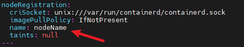
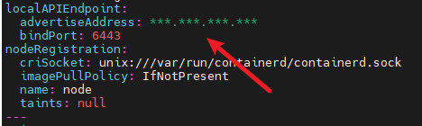
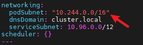
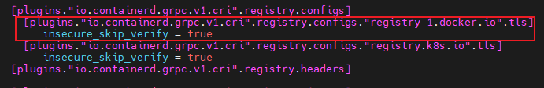

# Kubernetes Cluster Deployment Guide Based on containerd

Starting from version 1.21, Kubernetes no longer supports the Kubernetes+Docker setup for cluster deployment. This guide demonstrates how to quickly set up a Kubernetes cluster using containerd as the container runtime. For custom cluster configurations, consult the [official documentation](https://kubernetes.io/docs/home/).

## Software Package Installation

### 1. Installing Required Packages

```sh
yum install -y containerd
yum install -y kubernetes*
yum install -y cri-tools
```

> [!NOTE]**Note**
>
> - If Docker is already installed on the system, uninstall it before installing containerd to prevent conflicts.

The required containerd version is 1.6.22-15 or higher. If the installed version is not supported, upgrade to version 1.6.22-15 using the following commands, or perform a manual upgrade.

```sh
wget --no-check-certificate https://repo.openeuler.org/openEuler-24.03-LTS/update/x86_64/Packages/containerd-1.6.22-15.oe2403.x86_64.rpm
rpm -Uvh containerd-1.6.22-15.oe2403.x86_64.rpm
```

The package versions downloaded via `yum` in this guide are:

```text
1. containerd
  - Architecture: x86_64
  - Version: 1.6.22-15
2. kubernetes - client/help/kubeadm/kubelet/master/node
  - Architecture: x86_64
  - Version: 1.29.1-4
3. cri-tools
  - Architecture: X86_64
  - Version: 1.29.0-3
```

### 2. Downloading CNI Components

```sh
mkdir -p /opt/cni/bin
cd /opt/cni/bin
wget --no-check-certificate https://github.com/containernetworking/plugins/releases/download/v1.5.1/cni-plugins-linux-amd64-v1.5.1.tgz
tar -xzvf ./cni-plugins-linux-amd64-v1.5.1.tgz -C .
```

> [!NOTE]**Note**
>
> - The provided download link is for the AMD64 architecture. Choose the appropriate version based on your system architecture. Other versions are available in the [GitHub repository](https://github.com/containernetworking/plugins/releases/).

### 3. Downloading CNI Plugin (Flannel)

```sh
wget https://raw.githubusercontent.com/flannel-io/flannel/master/Documentation/kube-flannel.yml --no-check-certificate
```

## Environment Configuration

This section configures the OS environment required for Kubernetes.

### 1. Setting the Host Name

```sh
hostnamectl set-hostname nodeName
```

### 2. Configuring the Firewall

**Method 1:**

Configure firewall rules to open ports for etcd and the API Server, ensuring proper communication between the control plane and worker nodes.

Open ports for etcd:

```sh
firewall-cmd --zone=public --add-port=2379/tcp --permanent
firewall-cmd --zone=public --add-port=2380/tcp --permanent
```

Open ports for the API Server:

```sh
firewall-cmd --zone=public --add-port=6443/tcp --permanent
```

Apply the firewall rules:

```sh
firewall-cmd --reload
```

> [!NOTE]**Note**
>
> - Firewall configuration may prevent certain container images from functioning properly. To ensure smooth operation, open the necessary ports based on the images being used.

**Method 2:**

Disable the firewall using the following commands:

```sh
systemctl stop firewalld
systemctl disable firewalld
```

### 3. Disabling SELinux

SELinux security policies may block certain operations within containers, such as writing to specific directories, accessing network resources, or executing privileged operations. This can cause critical services like CoreDNS to fail, resulting in `CrashLoopBackOff` or `Error` states. Disable SELinux using the following commands:

```sh
setenforce 0
sed -i "s/SELINUX=enforcing/SELINUX=disabled/g" /etc/selinux/config
```

### 4. Disabling Swap

The Kubernetes scheduler allocates pods to nodes based on available memory and CPU resources. If swap is enabled on a node, the actual physical memory and logically available memory may not align, which can affect the scheduler decisions, leading to node overloading or incorrect scheduling. Therefore, disable swap:

```sh
swapoff -a
sed -ri 's/.*swap.*/#&/' /etc/fstab
```

### 5. Configuring the Network

Enable IPv6 and IPv4 traffic filtering on bridged networks using iptables, and enable IP forwarding to ensure inter-pod communication across nodes:

```sh
$ cat > /etc/sysctl.d/k8s.conf << EOF
net.bridge.bridge-nf-call-ip6tables = 1
net.bridge.bridge-nf-call-iptables = 1
net.ipv4.ip_forward = 1
vm.swappiness=0
EOF
$ modprobe br_netfilter
$ sysctl -p /etc/sysctl.d/k8s.conf
```

## Configuring containerd

This section configures containerd, including setting the pause image, cgroup driver, disabling certificate verification for the `registry.k8s.io` image repository, and configuring a proxy.

First, generate the default configuration file for containerd and output it to the file specified by `containerd_conf`:

```sh
containerd_conf="/etc/containerd/config.toml"
mkdir -p /etc/containerd
containerd config default > "${containerd_conf}"
```

Configure the pause image:

```sh
pause_img=$(kubeadm config images list | grep pause | tail -1)
sed -i "/sandbox_image/s#\".*\"#\"${pause_img}\"#" "${containerd_conf}"
```

Set the cgroup driver to systemd:

```sh
sed -i "/SystemdCgroup/s/=.*/= true/" "${containerd_conf}"
```

Disable certificate verification for the `registry.k8s.io` image repository:

```sh
sed -i '/plugins."io.containerd.grpc.v1.cri".registry.configs/a\[plugins."io.containerd.grpc.v1.cri".registry.configs."registry.k8s.io".tls]\n  insecure_skip_verify = true' /etc/containerd/config.toml
```

Configure the proxy (replace "***" in `HTTP_PROXY`, `HTTPS_PROXY`, and `NO_PROXY` with your proxy information):

```sh
$ server_path="/etc/systemd/system/containerd.service.d"
$ mkdir -p "${server_path}"
$ cat > "${server_path}"/http-proxy.conf << EOF
[Service]
Environment="HTTP_PROXY=***"
Environment="HTTPS_PROXY=***"
Environment="NO_PROXY=***"
EOF
```

Restart containerd to apply the configurations:

```sh
systemctl daemon-reload
systemctl restart containerd
```

## Configuring crictl to Use containerd as the Container Runtime

```sh
crictl config runtime-endpoint unix:///run/containerd/containerd.sock
crictl config image-endpoint unix:///run/containerd/containerd.sock
```

## Configuring kubelet to Use systemd as the Cgroup Driver

```sh
systemctl enable kubelet.service
echo 'KUBELET_EXTRA_ARGS="--runtime-cgroups=/systemd/system.slice --kubelet-cgroups=/systemd/system.slice"'  >> /etc/sysconfig/kubelet
systemctl restart kubelet
```

## Creating a Cluster Using Kubeadm (Control Plane Only)

### 1. Configuring Cluster Information

```sh
kubeadm config print init-defaults --component-configs KubeletConfiguration >> kubeletConfig.yaml
vim kubeletConfig.yaml
```

In the **kubeletConfig.yaml** file, configure the node name, advertise address (`advertiseAddress`), and the CIDR for the Pod network.

**Modify `name` to match the hostname, consistent with the first step in the environment configuration:**



**Change `advertiseAddress` to the IP address of the control plane:**



**Add `podSubnet` under `Networking` to specify the CIDR range:**



### 2. Deploying the Cluster

Use `kubeadm` to deploy the cluster. Many configurations are generated by default (such as authentication certificates). Refer to the [official documentation](https://kubernetes.io/docs/home/) for modifications.

**Disable the proxy (if applicable):**

```sh
unset http_proxy https_proxy
```

Deploy the cluster using `kubeadm init`:

```sh
kubeadm init --config  kubeletConfig.yaml
```

Specify the configuration file for `kubectl`:

```sh
mkdir -p "$HOME"/.kube
cp -i /etc/kubernetes/admin.conf "$HOME"/.kube/config
chown "$(id -u)":"$(id -g)" "$HOME"/.kube/config
export KUBECONFIG=/etc/kubernetes/admin.conf
```

### 3. Deploying the CNI Plugin (Flannel)

This tutorial uses Flannel as the CNI plugin. Below are the steps to download and deploy Flannel.

The Flannel used here is downloaded from the `registry-1.docker.io` image repository. To avoid certificate verification issues, configure the image repository to skip certificate verification in the containerd configuration file (**/etc/containerd/config.toml**).



Use `kubectl apply` to deploy the **kube-flannel.yml** file downloaded during the software package installation.

```sh
kubectl apply -f kube-flannel.yml
```

> [!NOTE]Note
>
> The control plane may have taint issues, causing the node status in `kubectl get nodes` to remain "not ready." Refer to the [official documentation](https://kubernetes.io/docs/concepts/scheduling-eviction/taint-and-toleration/) to remove taints.

## Joining the Cluster (Worker Nodes Only)

**Disable the proxy (if applicable):**

```sh
unset http_proxy https_proxy
```

After installing and configuring the environment on worker nodes, join the cluster using the following command:

```sh
kubeadm join <control-plane-host>:<control-plane-port> --token <token> --discovery-token-ca-cert-hash sha256:<hash>
```

This command is generated after `kubeadm init` completes on the control plane. Alternatively, you can generate it on the control plane using the following commands:

```sh
$ kubeadm token create  # Generate token.
$ openssl x509 -pubkey -in /etc/kubernetes/pki/ca.crt | openssl rsa -pubin -outform der 2>/dev/null | \
   openssl dgst -sha256 -hex | sed 's/^.* //'  # Get hash.
```

After joining, check the status of worker nodes on the control plane using:

```sh
kubectl get nodes
```

If the node status shows "not ready," it may be due to unsuccessful Flannel plugin deployment. In this case, run the locally generated Flannel executable to complete the deployment.

**Running kubectl Commands on Worker Nodes (Optional):**

To run `kubectl` commands on worker nodes, copy the control plane configuration file **/etc/kubernetes/admin.conf** to the same directory, then configure it using:

```sh
export KUBECONFIG=/etc/kubernetes/admin.conf
```
