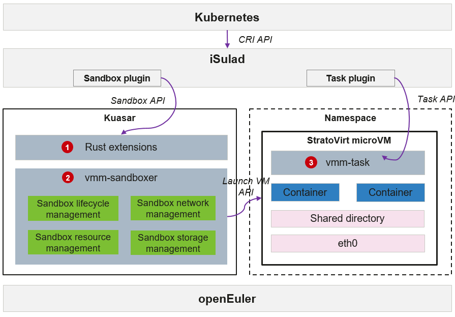

# Kuasar Multi-Sandbox Container Runtime

## Overview

Kuasar is a container runtime that supports unified management of multiple types of sandboxes. It supports multiple mainstream sandbox isolation technologies, including the kernel-based native container sandbox, lightweight virtualization technology-based microVM sandbox, application kernel sandbox based on process-level virtualization, and the emerging WebAssembly sandbox.
Based on the Kuasar unified container runtime combined with the iSulad container engine and StratoVirt virtualization engine, openEuler builds lightweight full-stack self-developed secure containers for cloud native scenarios, delivering key competitiveness of ultra-low overhead and ultra-fast startup.

**Figure 1** Kuasar architecture

> [!NOTE]NOTE  
> The root permission is required for installing and using Kuasar.
