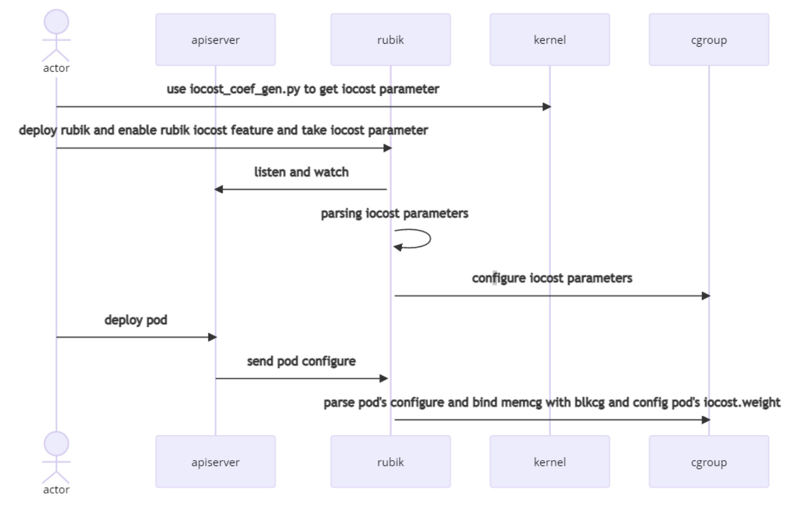

# Feature Introduction

## Absolute Preemption

Rubik allows you to configure priorities of services. In the hybrid deployment of online and offline services, Rubik ensures that online services preempt resources. CPU and memory resources can be preempted.

You can enable preemption using the following configuration:

```yaml
...
  "agent": {
    "enabledFeatures": [
      "preemption"
    ]
  },
  "preemption": {
    "resource": [
      "cpu",
      "memory"
    ]
  }
...
```

For details, see [Configuration Description](./configuration.md#preemption).

In addition, you need to add **volcano.sh/preemptable** to the YAML annotation of the pod to specify service priorities. For example:

```yaml
annotations:
    volcano.sh/preemptable: true
```

> [!NOTE]Note
>
> The **volcano.sh/preemptable** annotation is used by all Rubik features to identify whether the service is online or offline. **true** indicates an online service. **false** indicates an offline service.

### CPU Absolute Preemption

**Prerequisites**

- The kernel supports CPU priority configuration based on control groups (cgroups). The CPU subsystem provides the **cpu.qos_level** interface. The kernel of openEuler 22.03 or later is recommended.

**Kernel interface**

- The interface exists in the cgroup of the container in the **/sys/fs/cgroup/cpu** directory, for example, **/sys/fs/cgroup/cpu/kubepods/burstable/\<PodUID>/\<container-longid>**.
    - **cpu.qos_level**: enables the CPU priority configuration. The value can be **0** or **-1**, with **0** being the default.
        - **0** indicates an online service.
        - **1** indicates an offline service.

### Memory Absolute Preemption

In the hybrid deployment of online and offline services, Rubik ensures that offline services are first terminated in the case of out-of-memory (OOM).

**Prerequisites**

- The kernel supports memory priority configuration based on cgroups. The memory subsystem provides the **memory.qos_level** interface. The kernel of openEuler 22.03 or later is recommended.
- To enable the memory priority feature, run `echo 1 > /proc/sys/vm/memcg_qos_enable`.

**Kernel interface**

- **/proc/sys/vm/memcg_qos_enable**: enables the memory priority feature. The value can be **0** or **1**, with **0** being the default. You can run `echo 1 > /proc/sys/vm/memcg_qos_enable` to enable the feature.
    - **0**: The feature is disabled.
    - **1**: The feature is enabled.

- The interface exists in the cgroup of the container in the **/sys/fs/cgroup/memory** directory, for example, **/sys/fs/cgroup/memory/kubepods/burstable/\<PodUID>/\<container-longid>**.
    - **memory.qos_level**: enables the memory priority configuration. The value can be **0** or **-1**, with **0** being the default.
        - **0** indicates an online service.
        - **1** indicates an offline service.

## dynCache Memory Bandwidth and L3 Cache Access Limit

Rubik can limit pod memory bandwidth and L3 cache access for offline services to reduce the impact on online services.

**Prerequisites**

- The cache access and memory bandwidth limit feature supports only physical machines.
    - For x86 physical machines, the CAT and MBA functions of Intel RDT must be enabled in the OS by adding **rdt=l3cat,mba** to the kernel command line parameters (**cmdline**).
    - For ARM physical machines, the MPAM function must be enabled in the OS by adding **mpam=acpi** to the kernel command line parameters (**cmdline**).

- Due to kernel restrictions, RDT does not support the pseudo-locksetup mode.
- You need to manually mount **/sys/fs/resctrl**. Rubik reads and sets files in the **/sys/fs/resctrl** directory. This directory must be mounted before Rubik is started and cannot be unmounted during Rubik running.
- Rubik requires the **SYS_ADMIN** capability. To set files in the **/sys/fs/resctrl** directory on the host, the **SYS_ADMIN** capability must be assigned to the Rubik container.
- Rubik obtains the PID of the service container process on the host. Therefore, the Rubik container needs to share the PID namespace with the host.

**Rubik RDT Cgroups**

Rubik creates five cgroups (**rubik_max**, **rubik_high**, **rubik_middle**, **rubik_low** and **rubik_dynamic**) in the RDT resctrl directory (**/sys/fs/resctrl** by default). Rubik writes the watermarks to the **schemata** file of each corresponding cgroup upon startup. The low, middle, and high watermarks can be configured in **dynCache**. The max cgroup uses the default maximum value. The initial watermark of the dynamic cgroup is the same as that of the low cgroup.

**Rubik dynamic Cgroup**

When offline pods whose cache level is dynamic exist, Rubik collects the cache miss and LLC miss metrics of online service pods on the current node and adjusts the watermark of the rubik_dynamic cgroup. In this way, Rubik dynamically controls offline service pods in the dynamic cgroup.

### Memory Bandwidth and LLC Limit of the Pod

Rubik allows you to configure the memory bandwidth and LLC cgroup for a service pod in either of the following ways:

- Global annotation
  You can set **defaultLimitMode** in the global parameters of Rubik. Rubik automatically configures cgroups for offline service pods (marked by the **volcano.sh/preemptable** annotation in the absolute preemption configuration).
    - If the value is **static**, the pod is added to the **rubik_max** cgroup.
    - If the value is **dynamic**, the pod is added to the **rubik_dynamic** cgroup.
- Manual annotation
    - You can set the cache level for a service pod using the **volcano.sh/cache-limit** annotation and the pod to the specified cgroup. For example, the pod with the following configuration is added to the **rubik_low** cgroup:

  ```yaml
  annotations:
      volcano.sh/cache-limit: "low"
  ```

> [!NOTE]Note
>
> Cache limits apply to offline services only.
>
> The manual annotation overrides the global one. If you set **defaultLimitMode** in the global Rubik configuration and specify the cache level in the YAML configuration of a pod, the actual dynCache limit is the one specified in the pod YAML configuration.

### dynCache Kernel Interface

- Rubik creates five cgroup directories in **/sys/fs/resctrl** and modifies the **schemata** and **tasks** files of each cgroup.

### dynCache Configuration

The dynCache function is configured as follows:

```json
"agent": {
  "enabledFeatures": [
    "dynCache"
   ]
},
"dynCache": {
  "defaultLimitMode": "static",
  "adjustInterval": 1000,
  "perfDuration": 1000,
  "l3Percent": {
  "low": 20,
  "mid": 30,
  "high": 50
  },
  "memBandPercent": {
    "low": 10,
    "mid": 30,
    "high": 50
  }
}
```

For details, see [Configuration Description](./configuration.md#dyncache)

- **l3Percent** and **memBandPercent**:
  **l3Percent** and **memBandPercent** are used to configure the watermarks of the low, mid, and high cgroups.

  Assume that in the current environment **rdt bitmask=fffff** and **numa=2**. Based on the **low** value of **l3Percent** (20) and the **low** value of **memBandPercent** (10), Rubik configures **/sys/fs/resctrl/rubik_low** as follows:

  ```text
  L3:0=f;1=f
  MB:0=10;1=10
  ```

- defaultLimitMode: 
    - If the **volcano.sh/cache-limit** annotation is not specified for an offline pod, the **defaultLimitMode** of **cacheConfig** determines the cgroup to which the pod is added.
- **adjustInterval**: 
    - Interval for dynCache to dynamically adjust the **rubik_dynamic** cgroup, in milliseconds. The default value is **1000**.
- **perfDuration**: 
    - perf execution duration for dynCache, in milliseconds. The default value is **1000**.

### Precautions for dynCache

- dynCache takes affect only for offline pods.
- If a service container is manually restarted during running (the container ID remains unchanged but the container process ID changes), dynCache does not take effect for the container.
- After a service container is started and the dynCache level is set, the limit level cannot be changed.
- The sensitivity of adjusting the dynamic cgroup is affected **adjustInterval** and **perfDuration** values in the Rubik configuration file and the number of online service pods on the node. If the impact detection result indicates that adjustment is required, the adjustment interval fluctuates within the range **\[adjustInterval + perfDuration, adjustInterval + perfDuration x Number of pods\]**. You can set the configuration items based on your required sensitivity.

## dynMemory Tiered Memory Reclamation

Rubik supports multiple memory strategies. You can apply different memory allocation methods to different scenarios.

### fssr

fssr is kernel cgroup-based dynamic watermark control. **memory.high** is a memcg-level watermark interface provided by the kernel. Rubik continuously detects memory usage and dynamically adjusts the **memory.high** limit of offline services to suppress the memory usage of offline services, ensuring the quality of online services.

The core logic of fssr is as follows:

- Rubik calculates the memory to reserve upon startup. The default value is the smaller of 10% of total memory or 10 GB.
- Rubik sets the cgroup-level watermark of the offline container. The kernel provides the **memory.high** and **memory.high_async_ratio** interfaces for configuring the soft upper limit and alarm watermark of the cgroup. By default, **memory.high** is 80% of the total memory (**total_memory**).
- Rubik obtains the free memory (**free_memory**).
- When **free_memory** is less than **reserved_memory**, Rubik decreases **memory.high** for the offline container. The amount decreased each time is 10% of **total_memory**.
- If **free_memory** is more than double the amount of **reserved_memory**, Rubik increases **memory.high**. The amount increased each time is 1% of **total_memory**.

**Kernel interface**

- memory.high

### dynMemory Configuration

The strategy and check interval of the dynMemory module can be specified in **dynMemory**:

```json
"dynMemory": {
    "policy": "fssr"
}
```

- **policy** indicates the dynMemory policy, which supports **fssr**.

## Flexible Bandwidth

To effectively solve the problem of QoS deterioration caused by the CPU bandwidth limit of a service, the Rubik provides flexible bandwidth to allow the container to use extra CPU resources, ensuring stable service running. The flexible bandwidth solution is implemented in both kernel mode and user mode. They cannot be used at the same time.

The user-mode solution is implemented through the CFS bandwidth control capability provided by the Linux kernel. On the premise that the load watermark of the entire system is secure and stable and does not affect the running of other services, the dual-watermark mechanism allows service containers to adaptively adjust the CPU bandwidth limit, relieving CPU resource bottlenecks and improving service performance.

The kernel-mode solution is implemented through the CPU burst capability provided by the Linux kernel, which allows containers to temporarily exceed its CPU usage limit. You need to manually configure the kernel-mode configuration by setting the burst value for each pod. Rubik does not automatically sets the values.

### quotaTurbo User-Mode Solution

You need manually set the **volcano.sh/quota-turbo="true"** annotation for the service pod that requires flexible CPU bandwidth. This annotation takes effect only for the pod whose CPU quota is limited, that is, **CPULimit** is specified in the YAML file.
The user-mode flexible bandwidth policy periodically adjusts the CPU quota of an allowlist container based on the CPU load of the entire system and container running status, and automatically checks and restores the quota values of all containers when Rubik is started or stopped. (The CPU quota described in this section refers to the **cpu.cfs_quota_us** parameter of the container.) The adjustment policies are as follows:

1. When the CPU load of the entire system is lower than the alarm threshold, if the allowlist container is suppressed by the CPU in the current period, Rubik slowly increases the CPU quota of the container based on the suppression status. The total container quota increase in a single period cannot exceed 1% of the total CPU quota of the current node.
2. When the CPU load of the entire system is higher than the high watermark, if the allowlist container is not suppressed by the CPU in the current period, Rubik slowly increases the container quota based on the watermark.
3. When the CPU load of the entire system is higher than the alarm threshold, if the current quota value of the allowlist container exceeds the configured value, Rubik quickly decreases the CPU quotas of all containers to ensure that the load is lower than the alarm watermark.
4. The maximum CPU quota that a container can have cannot exceed twice the configured value (for example, the **CPULimit** parameter specified in the pod YAML file), and cannot be less than the configured value.
5. The overall CPU usage of the container within 60 synchronization periods cannot exceed the configured value.
6. If the overall CPU usage of a node exceeds 10% within 1 minute, the container quota will not be increased in this period.

**Kernel interface**

The interface exists in the cgroup of the container in the **/sys/fs/cgroup/cpu** directory, for example, **/sys/fs/cgroup/cpu,cpuacct/kubepods/burstable/\<PodUID>/\<container-longid>**. The following files are involved:

- **cpu.cfs_quota_us**
- **cpu.cfs_period_us**
- **cpu.stat**

#### quotaTurbo Configuration

The quotaTurbo function is configured as follows:

```json
"agent": {
    "enabledFeatures": [
      "quotaTurbo"
    ]
  },
"quotaTurbo": {
    "highWaterMark": 60,
    "alarmWaterMark": 80,
    "syncInterval": 100
}
```

For details, see [Configuration Description](./configuration.md#quotaturbo).

- **highWaterMark** is the high watermark of CPU load.
- **alarmWaterMark** is the alarm watermark of CPU load.
- **syncInterval** is the interval for triggering container quota updates, in milliseconds.

You need to manually specify the **volcano.sh/quota-turbo="true"** annotation for the service pod.

```yaml
metadata:
  annotations:
    # true means to add the pod to the allowlist of quotaTurbo
    volcano.sh/quota-turbo : "true"
```

### quotaBurst Kernel-Mode Solution

quotaBurst can be enabled through the **cpu.cfs_burst_us** kernel interface. Rubik allows a container to accumulate CPU resources when the CPU usage of the container is lower than the quota and uses the accumulated CPU resources when the CPU usage exceeds the quota.

**Kernel interface**

The interface exists in the cgroup of the container in the **/sys/fs/cgroup/cpu** directory, for example, **/sys/fs/cgroup/cpu/kubepods/burstable/\<PodUID>/\<container-longid>**. The annotation value is written into the following file:

- **cpu.cfs_burst_us**

> [!NOTE]Note
>
> The kernel-mode solution is implemented through the **cpu.cfs_burst_us** interface. The **cpu.cfs_burst_us** file must exist in the CPU subsystem directory of the cgroup. The value of **cpu.cfs_burst_us** can be as follows:
>
> - When **cpu.cfs_quota_us** is not -1, the sum of **cfs_burst_us** and **cfs_quota_us** must not be greater than $2^{44}$-1, and **cfs_burst_us** is less than or equal to **cfs_quota_us**.
> - When **cpu.cfs_quota_us** is -1, the CPU burst function is not enabled, and **cfs_burst_us** is 0.

#### quotaBurst Configuration

The quotaBurst function is configured as follows:

```json
"agent": {
  "enabledFeatures": [
    "quotaBurst"
  ]
}
```

You need to manually specify the **volcano.sh/quota-burst-time** annotation for the service pod or run `kubectl annotate` to dynamically add the annotation.

- In the YAML file upon pod creation:

  ```yaml
  metadata:
    annotations:
      # The default unit is microsecond.
      volcano.sh/quota-burst-time : "2000"
  ```

- Annotation modification: You can run the `kubectl annotate` command to dynamically modify annotation. For example:

  ```bash
  kubectl annotate --overwrite pods <podname> volcano.sh/quota-burst-time='3000'
  ```

### Constraints

- The user-mode CPU bandwidth control is implemented through the **cpu.cfs_period_us** (CFS bandwidth control) and **cpu.cfs_quota_us** parameters. The following restrictions apply:
    - To avoid unknown errors, other users are not allowed to modify CFS bandwidth control parameters (including but not limited to **cpu.cfs_quota_us** and **cpu.cfs_period_us**).
    - Do not use this function together with similar programs that limit CPU resources. Otherwise, the user-mode function cannot be used properly.
    - If you monitor the metrics related to CFS bandwidth control, using this feature may affect the consistency of the monitored metrics.
- The following restrictions apply to the kernel-mode solution:
    - Use the Kubernetes interface to set the burst value of the pod. Do not manually modify the **cpu.cfs_burst_us** file in the CPU cgroup directory of the container.
- Do not enable both kernel-mode and user-mode flexible bandwidth solutions at the same time.

## I/O Weight Control Based on ioCost

To solve the problem that the QoS of online services deteriorates due to high I/O usage of offline services, Rubik provides the I/O weight control function based on ioCost of cgroup v1.
For more, see the [ioCost description](https://www.kernel.org/doc/html/latest/admin-guide/cgroup-v2.html#io:~:text=correct%20memory%20ownership.-,IO,-%C2%B6).

**Prerequisites**

Rubik can control the I/O weight distribution of different pods through iocost of cgroup v1. Therefore, the kernel must support the following features:

- cgroup v1 blkcg iocost
- cgroup v1 writeback

The **blkio.cost.qos** and **blkio.cost.model** file interfaces exist in the **blkcg** root system file. For details about the implementation and interface description, see the openEuler kernel document.

### ioCost Implementation Description



The procedure of the Rubik implementation is as follows:

- When Rubik is deployed, Rubik parses the configuration and sets iocost parameters.
- Rubik registers the detection event to the Kubernetes API server.
- When a pod is deployed, the pod configuration information is write back to Rubik.
- Rubik parses the pod configuration information and configures the pod iocost weight based on the QoS level.

### ioCost Configuration

```json
"agent": {
  "enabledFeatures": [
    "ioCost"
  ]
}
"ioCost": [{
  "nodeName": "k8s-single",
  "config": [
    {
      "dev": "sdb",
      "enable": true,
      "model": "linear",
      "param": {
        "rbps": 10000000,
        "rseqiops": 10000000,
        "rrandiops": 10000000,
        "wbps": 10000000,
        "wseqiops": 10000000,
        "wrandiops": 10000000
      }
    }
  ]
}]
```

For details, see [Configuration Description](./configuration.md#iocost).

> [!NOTE]Note
>
> Parameters related to the ioCost linear model can be obtained through [**iocost_coef_gen.py**](https://github.com/torvalds/linux/blob/master/tools/cgroup/iocost_coef_gen.py).

## Interference Detection Based on Pressure Stall Information Metrics

Rubik can observe the pressure stall information (PSI) metrics of online pods to determine the pressure, evicts offline pods, and generates log alarms. Rubik uses **some avg10** as the indicator, which indicates the average blocking time proportion of any task within 10s. You can choose to monitor the CPU, memory, and I/O resources as required and set thresholds. If the blocking time proportion exceeds the threshold, Rubik evicts offline pods based on certain policies to release corresponding resources. If the CPU and memory usage of an online pod is high, Rubik evicts the offline service that occupies the most CPU or memory resources. If the I/O of offline services is high, Rubik evicts the offline service that occupies the most CPU resources.

The **volcano.sh/preemptable="true"/"false"** annotation distinguishes online and offline services.

```yaml
annotations:
    volcano.sh/preemptable: true
```

**Prerequisites**

Rubik depends on the PSI feature of cgroup v1. openEuler 22.03 LTS and later versions support the PSI interface of cgroup v1.
You can run the following command to check whether the PSI interface is enabled in the kernel:

```bash
cat /proc/cmdline | grep "psi=1 psi_v1=1"
```

If no results are returned, add the boot parameter to the kernel cmdline:

```bash
# View the kernel version.
uname -a
# View the boot file of the kernel.
grubby --update-kernel="$(grubby --default-kernel)" --args="psi=1 psi_v1=1"
# Reboot.
reboot
```

**Kernel interface**

The interface exists in the cgroup of the container in the **/sys/fs/cgroup/cpuacct** directory, for example, **/sys/fs/cgroup/cpu,cpuacct/kubepods/burstable/\<PodUID>/\<container-longid>**. The following items are involved:

- **cpu.pressure**
- **memory.pressure**
- **io.pressure**

### psi Configuration

```json
"agent": {
  "enabledFeatures": [
    "psi"
  ]
}
"psi": {
    "interval": 10,
    "resource": [
      "cpu",
      "memory",
      "io"
    ],
    "avg10Threshold": 5.0
}
```

For details, see [Configuration Description](./configuration.md#psi).

## CPU Eviction Watermark Control

Rubik enables the eviction of offline pods based on node CPU utilization to avoid CPU resource overload. You can set a CPU eviction watermark. Rubik monitors the average CPU utilization of the node over a defined window. If the average CPU utilization exceeds the watermark, Rubik evicts offline pods with high resource usage and shorter durations to free up resources.

> [!NOTE]Note
>
> The `volcano.sh/preemptable="true"/"false"` annotation distinguishes online and offline services.
>
> ```yaml
>  annotations:
>      volcano.sh/preemptable: true
>  ```

**Configuration details**

```json
{
  "agent": {
    "enabledFeatures": [
      "cpuevict"
    ]
  }
  "cpuevict": {
    "threshold": 60,
    "interval": 1,
    "windows": 2,
    "cooldown": 20
  }
}
```

For more details, see [Configuration Documentation](./configuration.md#cpu-eviction-watermark-control).

## Memory Eviction Watermark Control

Rubik allows the eviction of offline pods based on node memory utilization to prevent memory resource overload. You can configure a memory eviction watermark. If the node memory utilization surpasses the watermark, Rubik evicts offline pods with high resource usage and shorter durations to release resources.

> [!NOTE]Note
>
> The `volcano.sh/preemptable="true"/"false"` annotation distinguishes online and offline services.
>
> ```yaml
>  annotations:
>      volcano.sh/preemptable: true
>  ```

**Configuration details**

```json
{
  "agent": {
    "enabledFeatures": [
      "memoryevict"
    ]
  }
  "memoryevict": {
    "threshold": 60,
    "interval": 1,
    "cooldown": 4
  }
}
```

For more details, see [Configuration Documentation](./configuration.md#memory-eviction-watermark-control).
