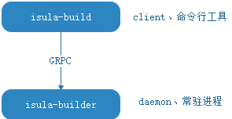

# Container Image Building

## Overview

isula-build is a container image build tool developed by the iSula container team. It allows you to quickly build container images using Dockerfiles.

The isula-build uses the server/client mode. The isula-build functions as a client and provides a group of command line tools for image build and management. The isula-builder functions as the server to process client management requests, and runs as a daemon process in the background.

> [!NOTE]Note
>
> Currently, isula-build supports OCI image format ([OCI Image Format Specification](https://github.com/opencontainers/image-spec/blob/main/spec.md/)) and Docker image format ([Image Manifest Version 2, Schema 2](https://docs.docker.com/registry/spec/manifest-v2-2/)). Use the `export ISULABUILD_CLI_EXPERIMENTAL=enabled` command to enable the experimental feature for supporting OCI image format. When the experimental feature is disabled, isula-build will take Docker image format as the default image format. Otherwise, isula-build will take OCI image format as the default image format.
