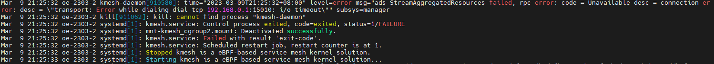
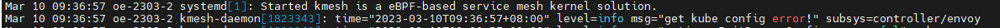

# Common Issues and Solutions

## Issue 1: Kmesh Service Exits with an Error When Started in Cluster Mode without Control Plane IP Address Configuration



Cause: When operating in cluster mode, Kmesh requires communication with the control plane to fetch configuration details. Without the correct control plane IP address, the service cannot proceed and exits with an error.

Solution: Follow the cluster mode setup instructions in the [Installation and Deployment](./installation_and_deployment.md) guide to properly configure the control plane IP address.

## Issue 2: Kmesh Service Displays "Get Kube Config Error!" during Startup



Cause: In cluster mode, Kmesh attempts to retrieve the control plane IP address from the k8s configuration. If the kubeconfig file path is not set in the environment, the service cannot access the kubeconfig and throws this error. (Note: This issue does not occur if the control plane IP address is manually specified in the Kmesh configuration file.)

Solution: Set up kubeconfig using the following commands:

```shell
mkdir -p $HOME/.kube
sudo cp -i /etc/kubernetes/admin.conf $HOME/.kube/config
sudo chown $(id -u):$(id -g) $HOME/.kube/config
```
