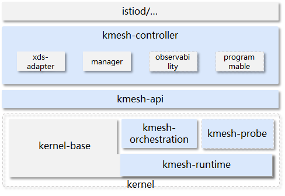

# Introduction to Kmesh

## Introduction

As the number of cloud-native applications surges, the scale of cloud applications and application SLAs pose high requirements on cloud infrastructure.

The Kubernetes-based cloud infrastructure can help implement agile deployment and management of applications. However, it does not support application traffic orchestration. The emergence of service mesh makes up for the lack of traffic orchestration in Kubernetes and complements Kubernetes to implement agile cloud application development and O&M. However, with the development of service mesh applications, the current Sidecar-based mesh architecture has obvious performance defects on the data plane, which has become a consensus in the industry.

* Long delay
    Take the typical service mesh Istio as an example. After meshing, the single-hop delay of service access increases by 2.65 ms, which cannot meet the requirements of delay-sensitive applications.

* High overhead
    In Istio, each Sidecar configuration occupies more than 50 MB memory, and the CPU exclusively occupies two cores by default. For large-scale clusters, the overhead is high, reducing the deployment density of service containers.

Based on the programmable kernel, Kmesh offloads mesh traffic governance to the OS and shortens the data path from 3 hops to 1 hop, greatly shortening the delay of the data plane and accelerating service innovation.

## Architecture

The following figure shows the overall architecture of Kmesh.

Kmesh consists of the following components:

* kmesh-controller
    Kmesh management program, which is responsible for Kmesh lifecycle management, xDS protocol interconnection, and O&M monitoring.

* kmesh-api
    API layer provided by Kmesh for external systems, including orchestration APIs converted by xDS and O&M monitoring channels.

* kmesh-runtime
    Runtime that supports L3 to L7 traffic orchestration implemented in the kernel.

* kmesh-orchestration
    L3 to L7 traffic orchestration implemented based on eBPF, such as routing, gray release, and load balancing.

* kmesh-probe
    O&M monitoring probe, providing E2E monitoring capabilities.
