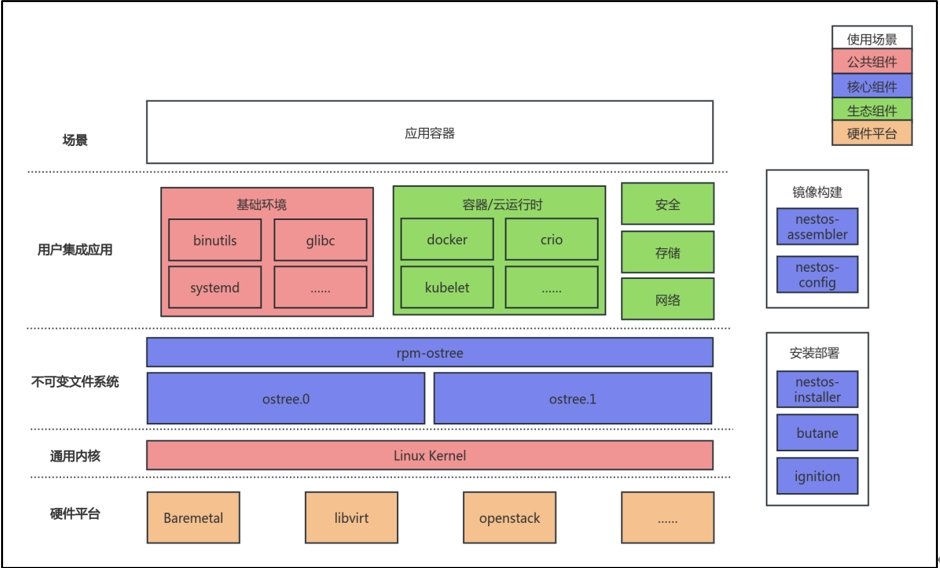
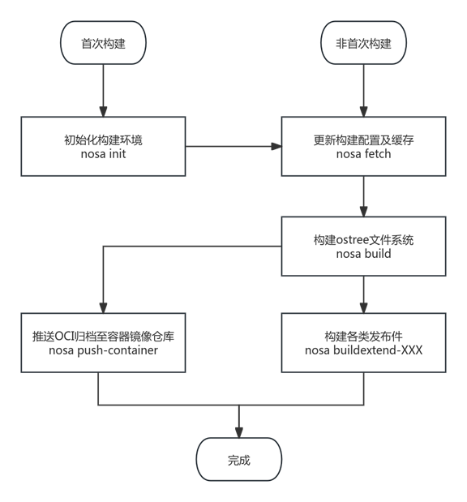

# NestOS for Container User Guide

## 1. Introduction to NestOS

### 1.1 Overview

NestOS, developed by KylinSoft and incubated in the openEuler community, is a cloud-native OS designed for modern infrastructure. It incorporates advanced technologies like rpm-ostree support and Ignition configuration, featuring a dual-root file system with mutual backup and atomic update capabilities. The system also includes the nestos-assembler tool for streamlined integration and building. Optimized for Kubernetes and OpenStack platforms, NestOS minimizes container runtime overhead, enabling efficient cluster formation and secure operation of large-scale containerized workloads.

This guide provides a comprehensive walkthrough of NestOS, covering its building, installation, deployment, and usage. It aims to help users maximize the system benefits for rapid and efficient configuration and deployment.

### 1.2 Application Scenarios and Advantages

NestOS serves as an ideal foundation for cloud environments centered around containerized applications. It resolves challenges such as fragmented operation and maintenance (O&M) practices and redundant platform development, which arise from the decoupling of container and orchestration technologies from the underlying infrastructure. By ensuring alignment between application services and the base OS, NestOS delivers consistent and streamlined O&M.



## 2. Environment Preparation

### 2.1 Build Environment Requirements

#### 2.1.1 Requirements for Building the nestos-assembler Tool

- Use openEuler for optimal results.
- Ensure at least 5 GB of available drive space.

#### 2.1.2 Requirements for Building NestOS

|   Category   |      Requirements       |
| :----------: | :---------------------: |
|     CPU      |         4 vCPUs         |
|    Memory    |          4 GB           |
|    Drive     | Available space > 10 GB |
| Architecture |    x86_64 or AArch64    |
|    Others    |     Support for KVM     |

### 2.2 Deployment Configuration Requirements

|   Category   | Recommended Configuration | Minimum Configuration |
| :----------: | :-----------------------: | :-------------------: |
|     CPU      |         > 4 vCPU          |        1 vCPU         |
|    Memory    |           > 4GB           |        512 MB         |
|    Drive     |          > 20GB           |         10 GB         |
| Architecture |      x86_64, aarch64      |           /           |

## 3. Quick Start

### 3.1 Quick Build

(1) Obtain the nestos-assembler container image.

You are advised the openEuler-based base image. For additional details, see [Section 6.1](#_6-1-nestos-assembler-container-image-creation).

```shell
docker pull hub.oepkgs.net/nestos/nestos-assembler:24.03-LTS.20240903.0-aarch64
```

(2) Create a script named `nosa` and save it to `/usr/local/bin`, then make it executable.

```shell
#!/bin/bash

sudo docker run --rm  -it --security-opt label=disable --privileged --user=root                        \
           -v ${PWD}:/srv/ --device /dev/kvm --device /dev/fuse --network=host                                 \
           --tmpfs /tmp -v /var/tmp:/var/tmp -v /root/.ssh/:/root/.ssh/   -v /etc/pki/ca-trust/:/etc/pki/ca-trust/                                        \
           ${COREOS_ASSEMBLER_CONFIG_GIT:+-v $COREOS_ASSEMBLER_CONFIG_GIT:/srv/src/config/:ro}   \
           ${COREOS_ASSEMBLER_GIT:+-v $COREOS_ASSEMBLER_GIT/src/:/usr/lib/coreos-assembler/:ro}  \
           ${COREOS_ASSEMBLER_CONTAINER_RUNTIME_ARGS}                                            \
           ${COREOS_ASSEMBLER_CONTAINER:-nestos-assembler:your_tag} "$@"
```

Note: Replace the value of `COREOS_ASSEMBLER_CONTAINER` with the actual nestos-assembler container image in your environment.

(3) Obtain nestos-config.

Use `nosa init` to initialize the build workspace, pull the build configuration, and create the `nestos-build` directory. Run the following command in this directory:

```shell
nosa init https://gitee.com/openeuler/nestos-config
```

(4) Adjust build configurations.

nestos-config provides default build configurations, so no additional steps are required. For customization, refer to [Section 5](#_5-build-configuration-nestos-config).

(5) Build NestOS images.

```shell
# Pull build configurations and update cache.
nosa fetch
# Generate root file system, qcow2, and OCI images.
nosa build
# Generate live ISO and PXE images.
nosa buildextend-metal
nosa buildextend-metal4k
nosa buildextend-live
```

For detailed build and deployment steps, refer to [Section 6](#_6-build-process).

### 3.2 Quick Deployment

Using the NestOS ISO image as an example, boot into the live environment and execute the following command to complete the installation by following the wizard:

```shell
sudo installnestos
```

For alternative deployment methods, see [Section 8](#_8-deployment-process).

## 4. Default Configuration

|            Item             |              Default Configuration               |
| :-------------------------: | :----------------------------------------------: |
|       Docker service        | Disabled by default, requires manual activation. |
| SSH service security policy |    Supports only key-based login by default.     |

## 5. Build Configuration: nestos-config

### 5.1 Obtaining Configuration

The repository for nestos-config is located at <https://gitee.com/openeuler/nestos-config>

### 5.2 Directory Structure Explanation

|  Directory/File   |              Description               |
| :---------------: | :------------------------------------: |
|      live/*       | Boot configuration for live ISO builds |
|    overlay.d/*    |       Custom file configurations       |
|      tests/*      | User-defined test case configurations  |
|      *.repo       |       Repository configurations        |
| .yaml, manifests/ |       Main build configurations        |

### 5.3 Key Files

#### 5.3.1 .repo Files

.repo files in the directory are used to configure software repositories for building NestOS.

#### 5.3.2 YAML Configuration Files

YAML files in the directory provide various configurations for NestOS builds. For details, refer to [Section 5.4](#_5-4-key-fields).

### 5.4 Key Fields

| Field                                       | Purpose                                                                                                                           |
| :------------------------------------------ | --------------------------------------------------------------------------------------------------------------------------------- |
| packages-aarch64, packages-x86_64, packages | Scope of software package integration                                                                                             |
| exclude-packages                            | Blocklist for software package integration                                                                                        |
| remove-from-packages                        | Files/folders to remove from specified packages                                                                                   |
| remove-files                                | Files/folders to remove                                                                                                           |
| extra-kargs                                 | Additional kernel boot parameters                                                                                                 |
| initramfs-args                              | Initramfs build parameters                                                                                                        |
| postprocess                                 | Post-build scripts for the file system                                                                                            |
| default-target                              | Default target, such as **multi-user.target**                                                                                     |
| rojig.name, releasever                      | Image-related information (name and version)                                                                                      |
| lockfile-repos                              | List of repository names available for builds, which must match the repository names in the repo files described in [Section 5.3.1](#_5-3-1-repo-files) |

### 5.5 Configurable Items

#### 5.5.1 Repository Configuration

(1) Edit the .repo file in the configuration directory and modify its content to the desired software repositories.

```shell
$ vim nestos-pool.repo
[repo_name_1]
Name=xxx
baseurl = https://ip.address/1
enabled = 1

[repo_name_2]
Name=xxx
baseurl = https://ip.address/2
enabled = 1
```

(2) Modify the `lockfile-repos` field in the YAML configuration file to include the corresponding repository names.

Note: The repository name is the content inside `[]` in the repo file, not the `name` field.

```shell
$ vim manifests/rpmlist.yaml
Modify the `lockfile-repos` field as follows:
lockfile-repos:
- repo_name_1
- repo_name_2
```

#### 5.5.2 Software Package Customization

Modify the `packages`, `packages-aarch64`, and `packages-x86_64` fields to add or remove software packages.

For example, adding `nano` to the `packages` field ensures that the system includes `nano` after installation.

```shell
$ vim manifests/rpmlist.yaml
packages:
- bootupd
...
- authselect
- nano
...
packages-aarch64:
- grub2-efi-aa64
packages-x86_64:
- microcode_ctl
- grub2-efi-x64
```

#### 5.5.3 Image Name and Version Customization

Modify the `releasever` and `rojig.name` fields in the YAML file to control the image version and name.

```shell
$ vim manifest.yaml

releasever: "1.0"
rojig:
  license: MIT
  name: nestos
  summary: NestOS stable
```

With the above configuration, the built image format will be **nestos-1.0.$(date "+%Y%m%d").$build_num.$type**, where **build_num** is the build count and **type** is the type suffix.

#### 5.5.4 Image Release Information Customization

Normally, release information is provided by the integrated release package (e.g., `openeuler-release`). However, you can rewrite the **/etc/os-release** file by adding a **postprocess** script.

```shell
$ vim manifests/system-configuration.yaml
# Add the following content to postprocess. If the content already exists, simply modify the corresponding release information.
postprocess:
  - |
    #!/usr/bin/env bash
    set -xeuo pipefail
    export OSTREE_VERSION="$(tail -1 /etc/os-release)"
    date_now=$(date "+%Y%m%d")
    echo -e 'NAME="openEuler NestOS"\nVERSION="24.03-LTS"\nID="openeuler"\nVERSION_ID="24.03-LTS"\nPRETTY_NAME="NestOS"\nANSI_COLOR="0;31"\nBUILDID="'${date_now}'"\nVARIANT="NestOS"\nVARIANT_ID="nestos"\n' > /usr/lib/os-release
    echo -e $OSTREE_VERSION >> /usr/lib/os-release
    cp -f /usr/lib/os-release /etc/os-release 
```

#### 5.5.5 Custom File Creation

Add or modify custom files in the **overlay.d** directory. This allows for customization of the image content.

```shell
mkdir -p overlay.d/15nestos/etc/test/test.txt
echo "This is a test message !" > overlay.d/15nestos/etc/test/test.txt
```

Using the above configuration to build the image. After image boot, the content of the corresponding file in the system will match the custom content added above.

```shell
[root@nosa-devsh ~]# cat /etc/test/test.txt
This is a test message !
```

## 6. Build Process

NestOS employs a containerized method to bundle the build toolchain into a comprehensive container image called nestos-assembler.

NestOS enables users to create the nestos-assembler container image, simplifying the process of building various NestOS image formats in any Linux distribution environment, such as within existing CI/CD pipelines. Additionally, users can manage, debug, and automate testing of build artifacts using this image.

### 6.1 nestos-assembler Container Image Creation

#### 6.1.1 Prerequisites

1. Prepare the base container image.

    The nestos-assembler container image must be based on a base image that supports the Yum or DNF package manager. Although it can be created from any distribution base image, using an openEuler base image is recommended to reduce software compatibility issues.

2. Install required software packages.

    Install Docker, the essential dependency:

    ```shell
    dnf install -y docker
    ```

3. Clone the nestos-assembler source code repository.

```shell
git clone --depth=1 --single-branch https://gitee.com/openeuler/nestos-assembler.git
```

#### 6.1.2 Building the nestos-assembler Container Image

Using the openEuler container image as the base, build the image with the following command:

```shell
cd nestos-assembler/
docker build -f Dockerfile . -t nestos-assembler:your_tag
```

### 6.2 nestos-assembler Container Image Usage

#### 6.2.1 Prerequisites

1. Prepare the nestos-assembler container image.

    Once the nestos-assembler container image is built following [Section 6.1](#_6-1-nestos-assembler-container-image-creation), it can be managed and distributed via a privately hosted container image registry. Ensure the correct version of the nestos-assembler container image is pulled before initiating the NestOS build.

2. Create the nosa script.

    To streamline user operations, you can write a `nosa` command script. This is particularly useful as the NestOS build process involves multiple calls to the nestos-assembler container image for executing various commands and configuring numerous parameters. For quick build details, see [Section 3.1](#_3-1-quick-build).

#### 6.2.2 Usage Instructions

nestos-assembler commands

|        Command        |                                       Description                                       |
| :-------------------: | :-------------------------------------------------------------------------------------: |
|         init          |   Initialize the build environment and configuration. See [Section 6.3](#_6-3-build-environment-preparation) for details.    |
|         fetch         | Fetch the latest software packages to the local cache based on the build configuration. |
|         build         |         Build the ostree commit, which is the core command for building NestOS.         |
|          run          |       Directly start a QEMU instance, using the latest build version by default.        |
|         prune         |   Clean up historical build versions, retaining the latest three versions by default.   |
|         clean         |  Delete all build artifacts. Use the `--all` parameter to also clean the local cache.   |
|         list          |        List the versions and artifacts present in the current build environment.        |
|      build-fast       |             Quickly build a new version based on the previous build record.             |
|    push-container     |           Push the container image artifact to the container image registry.            |
|   buildextend-live    |          Build ISO artifacts and PXE images that support the live environment.          |
|   buildextend-metal   |                           Build raw artifacts for bare metal.                           |
|  buildextend-metal4k  |                  Build raw artifacts for bare metal in native 4K mode.                  |
| buildextend-openstack |                    Build QCOW2 artifacts for the OpenStack platform.                    |
|   buildextend-qemu    |                             Build QCOW2 artifacts for QEMU.                             |
|       basearch        |                     Retrieve the current architecture information.                      |
|       compress        |                                   Compress artifacts.                                   |
|         kola          |                               Automated testing framework                               |
|       kola-run        |             A wrapper for automated testing that outputs summarized results             |
|         runc          |                Mount the current build root file system in a container.                 |
|          tag          |                               Manage build project tags.                                |
|     virt-install      |                   Create an instance for the specified build version.                   |
|         meta          |                             Manage build project metadata.                              |
|         shell         |                       Enter the nestos-assembler container image.                       |

### 6.3 Build Environment Preparation

The NestOS build environment requires a dedicated empty folder as the working directory, supporting multiple builds while preserving and managing historical versions. Before setting up the build environment, ensure the build configuration is prepared (see [Section 5](#_5-build-configuration-nestos-config)).

You are advised to maintain a separate build configuration for each independent build environment. If you plan to build NestOS for various purposes, maintain multiple build configurations and their corresponding directories. This approach allows independent evolution of configurations and clearer version management.

#### 6.3.1 Initializing the Build Environment

Navigate to the target working directory and run the following command to initialize the build environment:

```shell
nosa init https://gitee.com/openeuler/nestos-config
```

Initialization is only required for the first build. Subsequent builds can reuse the same environment unless significant changes are made to the build configuration.

#### 6.3.2 Build Environment Structure

After initialization, the following folders are created in the working directory:

**builds**: stores build artifacts and metadata. The **latest** subdirectory is a symbolic link to the most recent build version.

**cache**: contains cached data pulled from software sources and package lists specified in the build configuration. Historical NestOS ostree repositories are also stored here.

**overrides**: used to place files or RPM packages that should be added to the rootfs of the final artifact during the build process.

**src**: holds the build configuration, including nestos-config-related content.

**tmp**: used during builds and automated testing. In case of errors, you can inspect VM CLI outputs, journal logs, and other debugging information here.

### 6.4 Build Steps

The primary steps and reference commands for building NestOS are outlined below.



#### 6.4.1 Initial Build

For the initial build, the build environment must be initialized. Refer to [Section 6.3](#_6-3-build-environment-preparation) for detailed instructions.

For subsequent builds, the existing build environment can be reused. Use `nosa list` to check the current versions and corresponding artifacts in the build environment.

#### 6.4.2 Updating Build Configuration and Cache

After initializing the build environment, run the following command to update the build configuration and cache:

```shell
nosa fetch
```

This step validates the build configuration and pulls software packages from the configured sources to the local cache. When the build configuration changes or you want to update to the latest software versions, repeat this step. Otherwise, the build may fail or produce unexpected results.

If significant changes are made to the build configuration and you want to clear the local cache and re-fetch, use:

```shell
nosa clean --all
```

#### 6.4.3 Building the Immutable Root File system

The core of NestOS, an immutable OS, is its immutable root file system based on ostree technology. Run the following command to build the ostree file system:

```shell
nosa build
```

By default, the `build` command generates the ostree file system and an OCI archive. You can also include `qemu`, `metal`, or `metal4k` to simultaneously build the corresponding artifacts, equivalent to running `buildextend-qemu`, `buildextend-metal`, and `buildextend-metal4k` afterward.

```shell
nosa build qemu metal metal4k
```

To add custom files or RPM packages during the NestOS build, place them in the **rootfs/** or **rpm/** folders under the **overrides** directory before running the `build` command.

#### 6.4.4 Building Various Artifacts

After running the `build` command, you can use `buildextend` commands to build different types of artifacts. Details are as follows.

- Building QCOW2 images:

```shell
nosa buildextend-qemu
```

- Building ISO images with a live environment or PXE boot components:

```shell
nosa buildextend-metal
nosa buildextend-metal4k
nosa buildextend-live
```

- Building QCOW2 images for the OpenStack environment:

```shell
nosa buildextend-openstack
```

- Building container images for container-based updates:

When the `nosa build` command is executed, an OCI archive format image is also generated. This image can be pushed to a local or remote image registry directly.

```shell
nosa push-container [container-image-name]
```

The remote image registry address must be appended to the container image name, and no `:` should appear except in the tag. If no `:` is detected, the command generates a tag in the format `{latest_build}-{arch}`. Example:

```shell
nosa push-container registry.example.com/nestos:1.0.20240903.0-x86_64
```

This command supports the following options:

`--authfile`: specifies the authentication file for logging into the remote image registry.

`--insecure`: bypasses SSL/TLS verification for self-signed certificates.

`--transport`: specifies the target image push protocol. The default is `docker`. Supported options:

- `containers-storage`: pushes to the local storage directory of container engines like Podman and CRIO.
- `dir`: pushes to a specified local directory.
- `docker`: pushes to a private or remote container image registry using the Docker API.
- `docker-archive`: exports an archive file for use with `docker load`.
- `docker-daemon`: pushes to the local storage directory of the Docker container engine.

### 6.5 Artifacts Acquisition

Once the build process is complete, the artifacts are stored in the following directory within the build environment:

```text
builds/{version}/{arch}/
```

For convenience, if you are only interested in the latest build version or are using CI/CD, a **latest** directory symbol link points to the most recent version directory:

```text
builds/latest/{arch}/
```

To reduce the size of the artifacts for easier transfer, you can compress them using the following command:

```shell
nosa compress
```

Note that compression removes the original files, which may disable some debugging commands. To restore the original files, use the decompression command:

```shell
nosa uncompress
```

### 6.6 Build Environment Maintenance

Before or after setting up the NestOS environment, you may need to address specific requirements. The following commands are recommended for resolving these issues.

#### 6.6.1 Cleaning Up Historical or Invalid Build Versions to Free Drive Space

To clean up historical build versions, run:

```shell
nosa prune
```

To delete all artifacts in the current build environment, run:

```shell
nosa clean
```

If the build configuration has changed software repositories or historical caches are no longer needed, you can completely clear the current build environment cache:

```shell
nosa clean --all
```

#### 6.6.2 Temporarily Running a Build Version Instance for Debugging or Verification

```shell
nosa run
```

Use `--qemu-image` or `--qemu-iso` to specify the boot image address. For additional parameters, refer to `nosa run --help`.

Once the instance starts, the build environment directory is mounted to **/var/mnt/workdir**, allowing access to the build environment.

#### 6.6.3 Running Automated Tests

```shell
nosa kola run
```

This command runs predefined test cases. You can also append a specific test case name to execute it individually.

```shell
nosa kola testiso
```

This command performs installation and deployment tests for ISO or PXE live environments, acting as a smoke test for the build process.

#### 6.6.4 Debugging and Verifying netsos-assembler

```shell
nosa shell
```

This command launches a shell environment within the build toolchain container, enabling you to verify the functionality of the build toolchain environment.

## 7. Deployment Configuration

### 7.1 Introduction

Before you deploy NestOS, it is essential to understand and prepare the necessary configurations. NestOS offers flexible configuration options through Ignition files, which can be managed using Butane. This simplifies automated deployment and environment setup for users.

This section provides a detailed overview of Butane functionality and usage, along with configuration examples for various scenarios. These configurations will help you quickly set up and run NestOS, ensuring system security and reliability while meeting application needs. Additionally, we will explore how to customize images by pre-integrating Ignition files, enabling efficient configuration and deployment for specific use cases.

### 7.2 Introduction to Butane

Butane is a tool that converts human-readable YAML configuration files into NestOS Ignition files. It simplifies the process of writing complex configurations by allowing users to create configuration files in a more readable format, which are then converted into JSON format suitable for NestOS.

NestOS has adapted Butane by adding support for the `nestos` variant and configuration specification version `v1.0.0`, corresponding to the Ignition configuration specification `v3.3.0`. This ensures configuration stability and compatibility.

### 7.3 Butane Usage

To install the Butane package, use the following command:

```shell
dnf install butane
```

Edit **example.yaml** and execute the following command to convert it into an Ignition file **example.ign**. The process of writing YAML files will be explained in detail later:

```shell
butane example.yaml -o example.ign -p
```

### 7.4 Supported Functional Scenarios

The following configuration examples (**example.yaml**) briefly describe the main functional scenarios and advanced usage methods supported by NestOS.

#### 7.4.1 Configuring Users, Groups, Passwords, and SSH Keys

```YAML
variant: nestos
version: 1.0.0
passwd:
  users:
    - name: nest
      ssh_authorized_keys:
        - ssh-rsa AAAAB3NzaC1yc2EAAAADAQABAAABAQDHn2eh...
    - name: jlebon
      groups:
        - wheel
      ssh_authorized_keys:
        - ssh-rsa AAAAB3NzaC1yc2EAAAADAQABAAABgQDC5QFS...
        - ssh-ed25519 AAAAC3NzaC1lZDI1NTE5AAAAIIveEaMRW...
    - name: miabbott
      groups:
        - docker
        - wheel
      password_hash: $y$j9T$aUmgEDoFIDPhGxEe2FUjc/$C5A...
      ssh_authorized_keys:
        - ssh-rsa AAAAB3NzaC1yc2EAAAADAQABAAACAQDTey7R...
```

#### 7.4.2 File Operations: Configuring Network Interfaces

```YAML
variant: nestos
version: 1.0.0
storage:
  files:
    - path: /etc/NetworkManager/system-connections/ens2.nmconnection
      mode: 0600
      contents:
        inline: |
          [connection]
          id=ens2
          type=ethernet
          interface-name=ens2
          [ipv4]
          address1=10.10.10.10/24,10.10.10.1
          dns=8.8.8.8;
          dns-search=
          may-fail=false
          method=manual
```

#### 7.4.3 Creating Directories, Files, and Symbolic Links with Permissions

```YAML
variant: nestos
version: 1.0.0
storage:
  directories:
  - path: /opt/tools
    overwrite: true
  files:
    - path: /var/helloworld
      overwrite: true
      contents:
        inline: Hello, world!
      mode: 0644
      user:
        name: dnsmasq
      group:
        name: dnsmasq
    - path: /opt/tools/transmogrifier
      overwrite: true
      contents:
        source: https://mytools.example.com/path/to/archive.gz
        compression: gzip
        verification:
          hash: sha512-00000000000000000000000000000000000000000000000000000000000000000000000000000000000000000000000000000000000000000000000000000000
      mode: 0555
  links:
    - path: /usr/local/bin/transmogrifier
      overwrite: true
      target: /opt/tools/transmogrifier
      hard: false
```

#### 7.4.4 Writing systemd Services: Starting and Stopping Containers

```YAML
variant: nestos
version: 1.0.0
systemd:
  units:
    - name: hello.service
      enabled: true
      contents: |
        [Unit]
        Description=MyApp
        After=network-online.target
        Wants=network-online.target

        [Service]
        TimeoutStartSec=0
        ExecStartPre=-/bin/podman kill busybox1
        ExecStartPre=-/bin/podman rm busybox1
        ExecStartPre=/bin/podman pull busybox
        ExecStart=/bin/podman run --name busybox1 busybox /bin/sh -c ""trap 'exit 0' INT TERM; while true; do echo Hello World; sleep 1; done""

        [Install]
        WantedBy=multi-user.target
```

### 7.5 Pre-Integration of Ignition Files

The NestOS build toolchain enables users to customize images based on specific use cases and requirements. After creating the image, nestos-installer offers various features for customizing image deployment and application, such as pre-integrating Ignition files, pre-allocating installation locations, and modifying kernel parameters. Below, we introduce the main functionalities.

#### 7.5.1 Pre-Integration of Ignition Files into ISO Images

Prepare the NestOS ISO image locally and install the nestos-installer package. Edit **example.yaml** and use the Butane tool to convert it into an Ignition file. In this example, we configure a simple username and password (the password must be encrypted; the example uses `qwer1234`), as shown below:

```YAML
variant: nestos
version: 1.0.0
passwd:
  users:
    - name: root
      password_hash: "$1$root$CPjzNGH.NqmQ7rh26EeXv1"
```

After converting the YAML file into an Ignition file, execute the following command to embed the Ignition file and specify the target drive location. Replace `xxx.iso` with the local NestOS ISO image:

```shell
nestos-installer iso customize --dest-device /dev/sda --dest-ignition example.ign xxx.iso
```

When installing using the ISO image with the embedded Ignition file , NestOS will automatically read the Ignition file and install it to the target drive. Once the progress bar reaches 100%, the system will automatically boot into the installed NestOS environment. Users can log in using the username and password configured in the Ignition file.

#### 7.5.2 Pre-Integration of Ignition Files into PXE Images

Prepare the NestOS PXE image locally. See [Section 6.5](#_6-5-artifacts-acquisition) for details on obtaining the components. The remaining steps are the same as above.

To simplify the process for users, nestos-installer also supports extracting PXE components from an ISO image. Execute the following command, replacing `xxx.iso` with the local NestOS ISO image:

```shell
nestos-installer iso extract pxe xxx.iso
```

This will generate the following output files:

```text
xxx-initrd.img
xxx-rootfs.img
xxx-vmlinuz
```

Execute the following command to pre-integrate the Ignition file and specify the target drive location:

```shell
nestos-installer pxe customize --dest-device /dev/sda --dest-ignition example.ign xxx-initrd.img --output custom-initrd.img
```

Replace `xxx-initrd.img` with `custom-initrd.img` according to the PXE installation method for NestOS. After booting, NestOS will automatically read the Ignition file and install it to the target drive. Once the progress bar reaches 100%, the system will automatically boot into the installed NestOS environment. Users can log in using the username and password configured in the Ignition file.

## 8. Deployment Process

### 8.1 Introduction

NestOS supports multiple deployment platforms and common deployment methods, currently focusing on QCOW2, ISO, and PXE. Compared to general-purpose OS deployments, the main difference lies in how to pass custom deployment configurations characterized by Ignition files. The following sections will introduce these methods in detail.

### 8.2 Installation Using QCOW2 Images

#### 8.2.1 Creating a QCOW2 Instance with QEMU

Prepare the NestOS QCOW2 image and the corresponding Ignition file (see [Section 7](#_7-deployment-configuration) for details). Execute the following commands in the terminal:

```shell
IGNITION_CONFIG="/path/to/example.ign"
IMAGE="/path/to/image.qcow2"
IGNITION_DEVICE_ARG="-fw_cfg name=opt/com.coreos/config,file=${IGNITION_CONFIG}"

qemu-img create -f qcow2 -F qcow2 -b ${IMAGE} my-nestos-vm.qcow2
```

For the AArch64 environment, execute the following command:

```shell
qemu-kvm -m 2048 -M virt -cpu host -nographic -drive if=virtio,file=my-nestos-vm.qcow2 ${IGNITION_DEVICE_ARG} -nic user,model=virtio,hostfwd=tcp::2222-:22 -bios /usr/share/edk2/aarch64/QEMU_EFI-pflash.raw
```

For the x86_64 environment, execute the following command:

```shell
qemu-kvm -m 2048 -M pc -cpu host -nographic -drive if=virtio,file=my-nestos-vm.qcow2 ${IGNITION_DEVICE_ARG} -nic user,model=virtio,hostfwd=tcp::2222-:22
```

#### 8.2.2 Creating a QCOW2 Instance with virt-install

Assuming the libvirt service is running normally and the network uses the default subnet bound to the `virbr0` bridge, you can follow these steps to create a NestOS instance.

Prepare the NestOS QCOW2 image and the corresponding Ignition file (see [Section 7](#_7-deployment-configuration) for details). Execute the following commands in the terminal:

```shell
IGNITION_CONFIG="/path/to/example.ign"
IMAGE="/path/to/image.qcow2"
VM_NAME="nestos"
VCPUS="4"
RAM_MB="4096"
DISK_GB="10"
IGNITION_DEVICE_ARG=(--qemu-commandline="-fw_cfg name=opt/com.coreos/config,file=${IGNITION_CONFIG}")
```

**Note: When using virt-install, the QCOW2 image and Ignition file must be specified with absolute paths.**

Execute the following command to create the instance:

```shell
virt-install --connect="qemu:///system" --name="${VM_NAME}" --vcpus="${VCPUS}" --memory="${RAM_MB}"  --os-variant="kylin-hostos10.0" --import --graphics=none --disk="size=${DISK_GB},backing_store=${IMAGE}"  --network bridge=virbr0 "${IGNITION_DEVICE_ARG[@]}
```

### 8.3 Installation Using ISO Images

Prepare the NestOS ISO image and boot it. The first boot of the NestOS ISO image will default to the Live environment, which is a volatile memory-based environment.

#### 8.3.1 Installing the OS to the Target Drive Using the nestos-installer Wizard Script

1. In the NestOS live environment, follow the printed instructions upon first entry. Enter the following command to automatically generate a simple Ignition file and proceed with the installation and reboot:

    ```shell
    sudo installnestos
    ```

2. Follow the terminal prompts to enter the username and password.

3. Select the target drive installation location. Press **Enter** to use the default option **/dev/sda**.

4. After completing the above steps, nestos-installer will begin installing NestOS to the target drive based on the provided configuration. Once the progress bar reaches 100%, the system will automatically reboot.

5. After rebooting, the system will automatically enter NestOS. Press **Enter** at the GRUB menu or wait 5 seconds to boot the system. Log in using the previously configured username and password. The installation is now complete.

#### 8.3.2 Manually Installing the OS to the Target Drive Using the nestos-installer Command

1. Prepare the Ignition file **example.ign** (see [Section 7](#_7-deployment-configuration) for details).

2. Follow the printed instructions upon first entry into the NestOS live environment. Enter the following command to begin the installation:

    ```shell
    sudo nestos-installer install /dev/sda --ignition-file example.ign
    ```

    If network access is available, the Ignition file can also be retrieved via a URL, for example:

    ```shell
    sudo nestos-installer install /dev/sda --ignition-file http://www.example.com/example.ign
    ```

3. After executing the above command, nestos-installer will begin installing NestOS to the target drive based on the provided configuration. Once the progress bar reaches 100%, the system will automatically reboot.

4. After rebooting, the system will automatically enter NestOS. Press **Enter** at the GRUB menu or wait 5 seconds to boot the system. Log in using the previously configured username and password. The installation is now complete.

### 8.4 PXE Deployment

The PXE installation components for NestOS include the kernel, **initramfs.img**, and **rootfs.img**. These components are generated using the `nosa buildextend-live` command (see [Section 6](#_6-build-process) for details).

1. Use the PXELINUX `KERNEL` command to specify the kernel. A simple example is as follows:

    ```shell
    KERNEL nestos-live-kernel-x86_64
    ```

2. Use the PXELINUX `APPEND` command to specify the initrd and rootfs. A simple example is as follows:

    ```shell
    APPEND initrd=nestos-live-initramfs.x86_64.img,nestos-live-rootfs.x86_64.img
    ```

    **Note: If you have pre-integrated the Ignition file into the PXE components as described in [Section 7.5](#_7-5-pre-integration-of-ignition-files), you only need to replace it here and skip the subsequent steps.**

3. Specify the installation location. For example, to use **/dev/sda**, append the following to the `APPEND` command:

    ```ini
    nestosos.inst.install_dev=/dev/sda
    ```

4. Specify the Ignition file, which must be retrieved over the network. Append the corresponding URL to the `APPEND` command, for example:

    ```ini
    nestos.inst.ignition_url=http://www.example.com/example.ign
    ```

5. After booting, NestOS will automatically read the Ignition file and install the OS to the target drive. Once the progress bar reaches 100%, the system will automatically boot into the installed NestOS environment. Users can log in using the username and password configured in the Ignition file.

## 9. Basic Usage

### 9.1 Introduction

NestOS employs an OS packaging solution based on ostree and rpm-ostree technologies, setting critical directories to read-only mode to prevent accidental modifications to core system files and configurations. Leveraging the overlay layering concept, it allows users to manage RPM packages on top of the base ostree filesystem without disrupting the initial system architecture. Additionally, it supports building OCI-format images, enabling OS version switching at the granularity of images.

### 9.2 SSH Connection

For security reasons, NestOS does not support password-based SSH login by default and only allows key-based authentication. This design enhances system security by mitigating risks associated with password leaks or weak password attacks.

The method for establishing an SSH connection using keys in NestOS is the same as in openEuler. If users need to temporarily enable password-based login, they can follow these steps:

1. Edit the additional configuration file of the SSH service:

    ```shell
    vi /etc/ssh/sshd_config.d/40-disable-passwords.conf
    ```

2. Modify the default `PasswordAuthentication` setting as follows:

    ```shell
    PasswordAuthentication yes
    ```

3. Restart the sshd service to temporarily enable password-based SSH login.

### 9.3 RPM Package Installation

**Note: Immutable OS discourages installing software packages in the runtime environment. This method is provided only for temporary debugging scenarios. For service requirements that necessitate changes to the integrated package list, rebuild the OS by updating the build configuration.**

NestOS does not support conventional package managers like Yum or DNF. Instead, it uses rpm-ostree to manage system updates and package installations. rpm-ostree combines the advantages of image-based and package-based management, allowing users to layer and manage RPM packages on top of the base OS without disrupting its initial structure. Use the following command to install an RPM package:

```shell
rpm-ostree install <packagename>
```

After installation, reboot the OS. The bootloader menu will display two branches, with the first branch being the latest by default:

```shell
systemctl reboot
```

After rebooting, check the system package layering status to confirm that the package has been installed in the current version:

```shell
rpm-ostree status -v
```

### 9.4 Version Rollback

After an update or RPM package installation, the previous version of the OS deployment remains on the drive. If the update causes issues, users can manually roll back to a previous version using rpm-ostree. The specific process is as follows:

#### 9.4.1 Temporary Rollback

To temporarily roll back to a previous OS deployment, hold down the **Shift** key during system boot. When the bootloader menu appears, select the corresponding branch (by default, there are two branches; choose the other one). Before doing this, you can use the following command to view the two existing version branches in the current environment:

```shell
rpm-ostree status
```

#### 9.4.2 Permanent Rollback

To permanently roll back to a previous OS deployment, run the following command in the current version. This operation will set system deployment of the previous version as the default deployment.

```shell
rpm-ostree rollback
```

Reboot to apply the changes. The default deployment option in the bootloader menu will have changed, eliminating the need for manual switching.

```shell
systemctl reboot
```

## 10. Container Image-Based Updates

### 10.1 Use Case Description

NestOS, as a container cloud base OS based on the immutable infrastructure concept, distributes and updates the file system as a whole. This approach brings significant convenience in terms of operations and security. However, in real-world production environments, the officially released versions often fail to meet user requirements. For example, users may want to integrate self-maintained critical foundational components by default or further trim software packages to reduce system runtime overhead based on specific scenarios. Therefore, compared to general-purpose OSs, users have stronger and more frequent customization needs for NestOS.

nestos-assembler can provide OCI-compliant container images. Beyond simply packaging and distributing the root file system, leveraging the ostree native container feature allows container cloud users to utilize familiar technology stacks. By writing a single ContainerFile (Dockerfile), users can easily build customized images for integrating custom components or subsequent upgrade and maintenance tasks.

### 10.2 Usage

#### 10.2.1 Customizing Images

- Basic steps

1. Refer to [Section 6](#_6-build-process) to build the NestOS container image, and use the `nosa push-container` command to push it to a public or private container image registry.
2. Write a Containerfile (Dockerfile) as shown in the following example:

    ```dockerfile
    FROM registry.example.com/nestos:1.0.20240603.0-x86_64

    # Perform custom build steps, such as installing software or copying self-built components.
    # Here, installing the strace package is used as an example.
    RUN rpm-ostree install strace && rm -rf /var/cache && ostree container commit
    ```

3. Run `docker build` or integrate it into CI/CD to build the corresponding image.

    > Note:
    > 1. NestOS does not have the yum/dnf package manager. If software packages need to be installed, use the `rpm-ostree install` command to install local RPM packages or software provided in the repository.
    > 2. If needed, you can also modify the software source configurations in the `/etc/yum.repo.d/` directory.
    > 3. Each meaningful build command should end with `&& ostree container commit`. From the perspective of container image build best practices, it is recommended to minimize the number of RUN layers.
    > 4. During the build process, non-/usr or /etc directory contents are cleaned up. Therefore, customization via container images is primarily suitable for software package or component updates. Do not use this method for system maintenance or configuration changes (e.g., adding users with `useradd`).

#### 10.2.2 Deploying/Upgrading Images

Assume that the container image built in the above steps is pushed as `registry.example.com/nestos:1.0.20240903.0-x86_64`.

In an environment where NestOS is already deployed, execute the following command:

```shell
sudo rpm-ostree rebase ostree-unverified-registry:registry.example.com/nestos:1.0.20240903.0-x86_64
```

Reboot to complete the deployment of the customized version.

After deployment is complete using the container image method, `rpm-ostree upgrade` will default to updating the source from the ostree update source to the container image address. Subsequently, you can update the container image under the same tag. Using `rpm-ostree upgrade` will detect if the remote image has been updated. If changes are detected, it will pull the latest image and complete the deployment.
