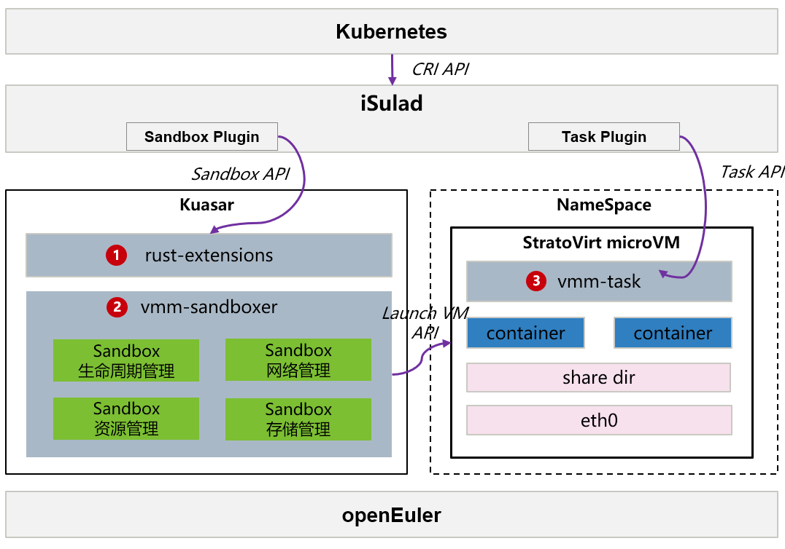

# Kuasar多沙箱容器运行时

## 概述

Kuasar是一款支持多种类型沙箱统一管理的容器运行时，可同时支持业界主流的多种沙箱隔离技术，例如包括基于内核的原生容器沙箱、基于轻量级虚拟化技术的microVM沙箱、基于进程级虚拟化的App Kernel沙箱，以及新兴的WebAssembly沙箱。
openEuler基于Kuasar统一容器运行时并结合已有openEuler生态中iSulad容器引擎和StratoVirt虚拟化引擎技术，打造面向云原生场景轻量级全栈自研的安全容器，构建极低底噪、极速启动的关键竞争力。 

**图 1**  Kuasar多沙箱容器运行时架构

> **说明：**
>kuasar的安装和使用需要使用root权限。
