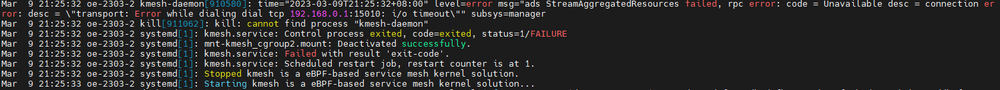
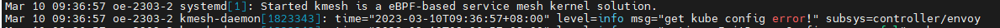

# 常见问题与解决方法

## **问题1：在使用集群启动模式时，若没有配置控制面程序ip信息，Kmesh服务启动后会报错退出**



原因：集群启动模式下，Kmesh服务需要跟控制面程序通信，然后从控制面获取配置信息，因此需要设置正确的控制面程序ip信息。

解决方法：参考[安装与部署](./安装与部署.md)章节中集群启动模式，设置正确的控制面程序ip信息。

## **问题2：Kmesh服务在启动时,提示"get kube config error!"**



原因：集群启动模式下，Kmesh服务会根据k8s的配置，自动获取控制面程序ip信息，若环境中没有配置k8s的kubeconfig路径，会导致获取kubeconfig失败，然后提示上述信息。（若已经手动修改Kmesh的配置文件，正确配置控制面程序ip信息，该问题可忽略）

解决方法：按如下方式配置kubeconfig：

```shell
mkdir -p $HOME/.kube
sudo cp -i /etc/kubernetes/admin.conf $HOME/.kube/config
sudo chown $(id -u):$(id -g) $HOME/.kube/config
```
