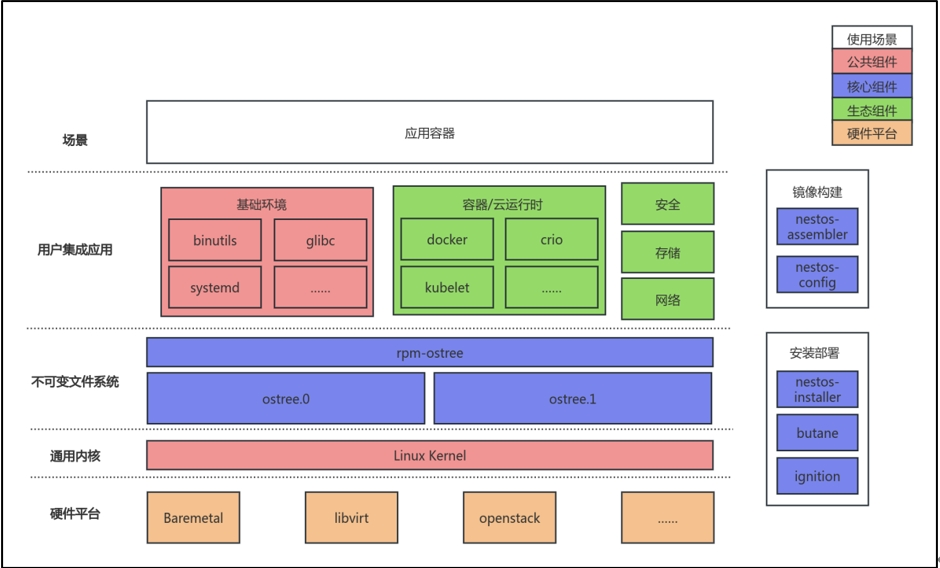
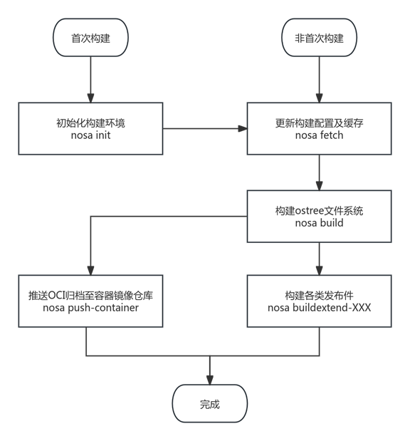

# NestOS用户使用指南

## 1. NestOS介绍

### 1.1 前言

NestOS是麒麟软件在openEuler社区开源孵化的云底座操作系统，集成了rpm-ostree支持、ignition配置等技术，采用双根文件系统互为主备、原子化更新的设计思路，提供nestos-assembler工具快速集成构建。NestOS针对K8S、OpenStack平台进行适配，优化容器运行底噪，使系统具备十分便捷的集群组建能力，可以更安全的运行大规模的容器化工作负载。

本手册将完整阐述从构建、安装部署到使用NestOS的全流程，帮助用户充分利用NestOS的优势，快速高效地完成系统的配置和部署。

### 1.2 应用场景与优势

NestOS 适合作为以容器化应用为主的云场景基础运行环境，解决了在使用容器技术与容器编排技术实现业务发布、运维时与底层环境高度解耦而带来的运维技术栈不统一，运维平台重复建设等问题，保证了业务与底座操作系统运维的一致性。



## 2. 环境准备

### 2.1 构建环境要求

#### 2.1.1 制作构建工具nestos-assembler环境要求

- 推荐使用openEuler环境

- 剩余可用硬盘空间 > 5G

#### 2.1.2 构建NestOS环境要求

| **类别** |     **要求**      |
| :------: | :---------------: |
|   CPU    |       4vcpu       |
|   内存   |        4GB        |
|   硬盘   | 剩余可用空间>10GB |
|   架构   |  x86_64或aarch64  |
|   其他   |      支持kvm      |

### 2.2 部署配置要求

| **类别** |  **推荐配置**   | **最低配置** |
| :------: | :-------------: | :----------: |
|   CPU    |     >4vcpu      |    1vcpu     |
|   内存   |      >4GB       |     512M     |
|   硬盘   |      >20GB      |     10GB     |
|   架构   | x86_64、aarch64 |      /       |

## 3. 快速使用

### 3.1 快速构建

1）获取nestos-assembler容器镜像

推荐使用基于openEuler的base镜像，更多说明请参考6.1

```bash
docker pull hub.oepkgs.net/nestos/nestos-assembler:24.03-LTS.20240903.0-aarch64
```

2）编写名为nosa的脚本并存放至/usr/local/bin，并赋予可执行权限

```bash
#!/bin/bash

sudo docker run --rm  -it --security-opt label=disable --privileged --user=root                        \
           -v ${PWD}:/srv/ --device /dev/kvm --device /dev/fuse --network=host                                 \
           --tmpfs /tmp -v /var/tmp:/var/tmp -v /root/.ssh/:/root/.ssh/   -v /etc/pki/ca-trust/:/etc/pki/ca-trust/                                        \
           ${COREOS_ASSEMBLER_CONFIG_GIT:+-v $COREOS_ASSEMBLER_CONFIG_GIT:/srv/src/config/:ro}   \
           ${COREOS_ASSEMBLER_GIT:+-v $COREOS_ASSEMBLER_GIT/src/:/usr/lib/coreos-assembler/:ro}  \
           ${COREOS_ASSEMBLER_CONTAINER_RUNTIME_ARGS}                                            \
           ${COREOS_ASSEMBLER_CONTAINER:-nestos-assembler:your_tag} "$@"
```

注意修改COREOS_ASSEMBLER_CONTAINER 的值为本地环境中实际的nestos-assembler容器镜像。

3）获取nestos-config

使用nosa init 初始化构建工作目录，拉取构建配置，创建工作目录nestos-build，在该目录下执行如下命令

```bash
nosa init https://gitee.com/openeuler/nestos-config
```

4）调整构建配置

nestos-config提供默认构建配置，无需额外操作。如需调整，请参考第5章。

5）NestOS镜像构建

```bash
# 拉取构建配置、更新缓存
nosa fetch
# 生成根文件系统、qcow2及OCI镜像
nosa build
# 生成live iso及PXE镜像
nosa buildextend-metal
nosa buildextend-metal4k
nosa buildextend-live
```

详细构建及部署流程请参考第6章。

### 3.2 快速部署

以NestOS ISO镜像为例，启动进入live环境后，执行如下命令根据向导提示完成安装：

```bash
sudo installnestos
```

其他部署方式请参考第8章。

## 4. 系统默认配置

|    **选项**     |      **默认配置**       |
| :-------------: | :---------------------: |
|   docker服务    | 默认disable，需主动开启 |
| ssh服务安全策略 |   默认仅支持密钥登录    |

## 5. 构建配置nestos-config

### 5.1 获取配置

nestos-config的仓库地址为<https://gitee.com/openeuler/nestos-config>

### 5.2 配置目录结构说明

| **目录/****文件** |        **说明**        |
| :---------------: | :--------------------: |
|      live/*       | 构建liveiso的引导配置  |
|    overlay.d/*    |     自定义文件配置     |
|      tests/*      | 用户自定义测试用例配置 |
|      *.repo       |       repo源配置       |
| .yaml，manifests/ |      主要构建配置      |

### 5.3 主要文件解释

#### 5.3.1 repo文件

目录下的repo文件可用来配置用于构建nestos的软件仓库。

#### 5.3.2 yaml配置文件

目录下的yaml文件主要是提供nestos构建的各种配置，详见5.4章节。

### 5.4 主要字段解释

| **字段名称**                                | **作用**                                                     |
| :------------------------------------------ | ------------------------------------------------------------ |
| packages-aarch64、packages-x86_64、packages | 软件包集成范围                                               |
| exclude-packages                            | 软件包集成黑名单                                             |
| remove-from-packages                        | 从指定软件包删除文件(夹)                                     |
| remove-files                                | 删除特定文件(夹)                                             |
| extra-kargs                                 | 额外内核引导参数                                             |
| initramfs-args                              | initramfs构建参数                                            |
| postprocess                                 | 文件系统构建后置脚本                                         |
| default-target                              | 配置default-target，如 multi-user.target                     |
| rolij.name、releasever                      | 镜像相关信息(镜像名称、版本)                                 |
| lockfile-repos                              | 构建可使用的仓库名列表,与5.3.1 介绍的repo文件中的仓库名需要对应 |

### 5.5 用户可配置项说明

#### 5.5.1 repo源配置

1）在配置目录编辑repo文件，将内容修改为期望的软件仓库

```bash
$ vim nestos-pool.repo
[repo_name_1]
Name=xxx
baseurl = https://ip.address/1
enabled = 1

[repo_name_2]
Name=xxx
baseurl = https://ip.address/2
enabled = 1
```

2）修改yaml配置文件中的lockfile-repo字段内容为相应的仓库名称列表

注：仓库名称为repo文件中[]内的内容，不是name字段内容

```bash
$ vim manifests/rpmlist.yaml
修改lockfile-repo字段内容为
lockfile-repos:
- repo_name_1
- repo_name_2
```

#### 5.5.2 软件包裁剪

修改packages、packages-aarch64、packages-x86_64字段，可在其中添加或删除软件包。

如下所示，在package字段中添加了nano，构建安装后系统中会有nano 。

```bash
$ vim manifests/rpmlist.yaml
packages:
- bootupd
...
- authselect
- nano
...
packages-aarch64:
- grub2-efi-aa64
packages-x86_64:
- microcode_ctl
- grub2-efi-x64
```

#### 5.5.3 自定义镜像名称与版本号

修改yaml文件中的releasever及rolij.name 字段，这些字段分别控制镜像的版本号及名称。

```bash
$ vim manifest.yaml

releasever: "1.0"
rojig:
  license: MIT
  name: nestos
  summary: NestOS stable
```

如上配置，构建出的镜像格式为：nestos-1.0.$(date "+%Y%m%d").$build_num.$type，其中build_num为构建次数，type为类型后缀。

#### 5.5.4 自定义镜像中的release信息

正常release信息是由我们集成的release包（如openeuler-release）提供的，但是我们也可以通过添加postprocess脚本对/etc/os-release文件进行重写操作。

```bash
$ vim manifests/ system-configuration.yaml
在postprocess添加如下内容，若已存在相关内容，则只需修改对应release信息即可
postprocess:
  - |
    #!/usr/bin/env bash
    set -xeuo pipefail
    export OSTREE_VERSION="$(tail -1 /etc/os-release)"
    date_now=$(date "+%Y%m%d")
    echo -e 'NAME="openEuler NestOS"\nVERSION="24.03-LTS"\nID="openeuler"\nVERSION_ID="24.03-LTS"\nPRETTY_NAME="NestOS"\nANSI_COLOR="0;31"\nBUILDID="'${date_now}'"\nVARIANT="NestOS"\nVARIANT_ID="nestos"\n' > /usr/lib/os-release
    echo -e $OSTREE_VERSION >> /usr/lib/os-release
    cp -f /usr/lib/os-release /etc/os-release 
```

#### 5.5.5 成自定义文件

在overlay.d目录下每个目录进行自定义文件的添加和修改，这种操作可以实现构建镜像内容的自定义。

```bash
mkdir -p overlay.d/15nestos/etc/test/test.txt
echo "This is a test message !" > overlay.d/15nestos/etc/test/test.txt
```

使用如上配置进行镜像构建，启动构建出的镜像，查看系统中对应文件内容即为我们上述自定义添加的内容。

```bash
[root@nosa-devsh ~]# cat /etc/test/test.txt 
This is a test message !
```

## 6.构建流程

NestOS采用容器化的方式将构建工具链集成为一个完整的容器镜像，称为NestOS-assembler。

NestOS提供构建NestOS-assembler容器镜像能力，方便用户使用。使用该容器镜像，用户可在任意linux发行版环境中构建多种形态NestOS镜像（例如在现有CICD环境中使用），也可对构建发布件进行管理、调试和自动化测试。

### 6.1 制作构建工具NestOS-assembler容器镜像

#### 6.1.1 前置步骤

1）准备容器base镜像

NestOS-assembler容器镜像需要基于支持yum/dnf软件包管理器的base镜像制作，理论上可由任意发行版base镜像制作，但为最大程度减少软件包兼容性问题，仍推荐使用基于openEuler的base镜像。

2）安装必要软件包

安装必备依赖docker

```bash
dnf install -y docker
```

3）克隆nestos-assembler源代码仓库

```bash
git clone --depth=1 --single-branch https://gitee.com/openeuler/nestos-assembler.git
```

#### 6.1.2 构建NestOS-assembler容器镜像

使用openEuler容器镜像作为base镜像，使用以下指令构建：

```bash
cd nestos-assembler/
docker build -f Dockerfile . -t nestos-assembler:your_tag
```

### 6.2 使用NestOS-assembler容器镜像

#### 6.2.1 前置步骤

1）准备nestos-assembler容器镜像

参考6.1章节构建nestos-assembler容器镜像后，可通过私有化部署容器镜像仓库对该容器镜像进行管理和分发。请确保构建NestOS前，拉取适当版本的nestos-assembler容器镜像至当前环境。

2）编写使用脚本nosa

因NestOS构建过程需多次调用nestos-assembler容器镜像执行不同命令，同时需配置较多参数，为简化用户操作，可编写nosa命令脚本，可参见3.1快速构建部分。

#### 6.2.2 使用说明

构建工具命令一览

|       **命令**        |                    **功能说明**                     |
| :-------------------: | :-------------------------------------------------: |
|         init          |          初始化构建环境及构建配置，详见6.3          |
|         fetch         |        根据构建配置获取最新软件包至本地缓存         |
|         build         |      构建ostree commit，是构建NestOS的核心命令      |
|          run          |     直接启动一个qemu实例，默认使用最新构建版本      |
|         prune         |        清理历史构建版本，默认保留最新3个版本        |
|         clean         | 删除全部构建发布件，添加--all参数时同步清理本地缓存 |
|         list          |        列出当前构建环境中存在的版本及发布件         |
|      build-fast       |           基于前次构建记录快速构建新版本            |
|    push-container     |          推送容器镜像发布件至容器镜像仓库           |
|   buildextend-live    |        构建支持live环境的ISO发布件及PXE镜像         |
|   buildextend-metal   |                 构建裸金属raw发布件                 |
|  buildextend-metal4k  |           构建原生4K模式的裸金属raw发布件           |
| buildextend-openstack |        构建适用于openstack平台的qcow2发布件         |
|   buildextend-qemu    |             构建适用于qemu的qcow2发布件             |
|       basearch        |                  获得当前架构信息                   |
|       compress        |                     压缩发布件                      |
|         kola          |                   自动化测试框架                    |
|       kola-run        |            输出汇总结果的自动化测试封装             |
|         runc          |          以容器方式挂载当前构建根文件系统           |
|          tag          |                   管理构建工程tag                   |
|     virt-install      |       通过virt-install为指定构建版本创建实例        |
|         meta          |                 管理构建工程元数据                  |
|         shell         |            进入nestos-assembler容器镜像             |

### 6.3 准备构建环境

NestOS构建环境需要独立的空文件夹作为工作目录，且支持多次构建，保留、管理历史构建版本。创建构建环境前需首先准备构建配置（参考第5章）。

建议一份独立维护的构建配置对应一个独立的构建环境，即如果您希望构建多个不同用途的NestOS，建议同时维护多份构建配置及对应的构建环境目录，这样可以保持不同用途的构建配置独立演进和较为清晰的版本管理。

#### 6.3.1 初始化构建环境

进入待初始化工作目录，执行如下命令即可初始化构建环境：

```bash
nosa init https://gitee.com/openeuler/nestos-config
```

仅首次构建时需初始化构建环境，后续构建在不对构建配置做出重大更改的前提下，可重复使用该构建环境。

#### 6.3.2 构建环境说明

初始化完成后，工作目录创建出如下文件夹：

**builds:**构建发布件及元数据存储目录，latest子目录软链接指向最新构建版本。

**cache:**缓存目录，根据构建配置中的软件源及软件包列表拉取至本地，历史构建NestOS的ostree repo均缓存于此目录。

**overrides:**构建过程希望附加到最终发布件rootfs中的文件或rpm包可置于此目录。

**src:**构建配置目录，存放nestos-config相关内容。

**tmp:**临时目录，构建过程、自动化测试等场景均会使用该目录作为临时目录，构建发生异常时可在此处查看虚拟机命令行输出、journal日志等信息。

### 6.4 构建步骤

NestOS构建主要步骤及参考命令如下：



#### 6.4.1 首次构建

首次构建时需初始化构建环境，详见6.3。

非首次构建可直接使用原构建环境，可通过nosa list查看当前构建环境已存在版本及对应发布件。

#### 6.4.2 更新构建配置及缓存

初始化构建环境后，执行如下命令更新构建配置及缓存：

```bash
nosa fetch
```

该步骤初步校验构建配置是否可用，并通过配置的软件源拉取软件包至本地缓存。当构建配置发生变更或单纯希望更新软件源中最新版本软件包，均需要重新执行该步骤，否则可能导致构建失败或不符合预期。

当构建配置发生较大变更，希望清空本地缓存重新拉取时，需执行如下命令：

```bash
nosa clean --all
```

#### 6.4.3 构建不可变根文件系统

NestOS不可变操作系统的核心是基于ostree技术的不可变根文件系统，执行如下步骤构建ostree文件系统：

```bash
nosa build
```

build命令默认会生成ostree文件系统和OCI归档文件，您也可以在执行命令时同步添加qemu、metal、metal4k中的一个或多个，同步构建发布件，等效于后续继续执行buildextend-qemu、buildextend-metal和buildextend-metal4k命令。

```bash
nosa build qemu metal metal4k
```

如您希望在构建NestOS时，添加自定义文件或rpm包，请在执行build命令前将相应文件放入构建环境overrides目录下rootfs/或rpm/文件夹。

#### 6.4.4 构建各类发布件

build命令执行完毕后，可继续执行buildextend-XXX命令用于构建各类型发布件，具体介绍如下：

- 构建qcow2镜像

```bash
nosa buildextend-qemu
```

- 构建带live环境的ISO镜像或PXE启动组件

```bash
nosa buildextend-metal
nosa buildextend-metal4k
nosa buildextend-live
```

- 构建适用于openstack环境的qcow2镜像

```bash
nosa buildextend-openstack
```

- 构建适用于容器镜像方式更新的容器镜像

执行nosa build命令构建ostree文件系统时，会同时生成ociarchive格式镜像，该镜像可直接执行如下命令推送到本地或远程镜像仓库，无需执行其他构建步骤。

```bash
nosa push-container [container-image-name]
```

   远程镜像仓库地址需附加到推送容器镜像名称中，且除隔离镜像tag外，不得出现":"。如未检测到":"，该命令会自动生成{latest_build}-{arch}格式的tag。示例如下：

```bash
nosa push-container registry.example.com/nestos:1.0.20240903.0-x86_64
```

该命令支持以下可选参数：

--authfile ：指定登录远程镜像仓库的鉴权文件

--insecure：如远程镜像仓库采用自签名证书等场景，添加该参数可不校验SSL/TLS协议

--transport：指定目标镜像推送协议，默认为docker，具体支持项及说明如下：

​ containers-storage：推送至podman、crio等容器引擎本地存储目录

​ dir：推送至指定本地目录

​ docker：以docker API推送至私有或远端容器镜像仓库

​ docker-archive：等效于docker save导出归档文件，可供docker load使用

​ docker-daemon：推送至docker容器引擎本地存储目录

### 6.5 获取发布件

构建完毕后，发布件均生成于构建环境中如下路径：

```bash
builds/{version}/{arch}/
```

如您仅关心最新构建版本或通过CI/CD调用，提供latest目录软链接至最新版本目录，即：

```bash
builds/latest/{arch}/
```

为方便传输，您可以调用如下命令，压缩发布件体积：

```bash
nosa compress
```

压缩后原文件会被移除，会导致部分调试命令无法使用，可以调用解压命令恢复原文件：

```bash
nosa uncompress
```

### 6.6 构建环境维护

在构建NestOS环境前后，可能存在如下需求，可使用推荐的命令解决相应问题：

#### 6.6.1 清理历史或无效构建版本，以释放磁盘空间

可以通过以下命令清理历史版本构建：

```bash
nosa prune
```

也可删除当前构建环境中的全部发布件：

```bash
nosa clean
```

如构建配置更换过软件源或历史缓存无保留价值，可彻底清理当前构建环境缓存：

```bash
nosa clean --all
```

#### 6.6.2 临时运行构建版本实例，用于调试或确认构建正确

```bash
nosa run
```

可通过--qemu-image或--qemu-iso指定启动镜像地址，其余参数请参考nosa run --help说明。

实例启动后，构建环境目录会被挂载至/var/mnt/workdir，可通过构建环境目录

#### 6.6.3 运行自动化测试

```bash
nosa kola run
```

该命令会执行预设的测试用例，也可在其后追加测试用例名称，单独执行单条用例。

```bash
nosa kola testiso
```

该命令会执行iso或pxe live环境安装部署测试，可作为构建工程的冒烟测试。

#### 6.6.4 调试验证构建工具（NestOS-assembler）

```bash
nosa shell
```

该命令可启动进入构建工具链容器的shell环境，您可以通过此命令验证构建工具链工作环境是否正常。

## 7. 部署配置

### 7.1 前言

在开始部署NestOS之前，了解和准备必要的配置是至关重要的。NestOS通过点火文件（ignition文件）提供了一系列灵活的配置选项，可以通过Butane工具进行管理，方便用户进行自动化部署和环境设置。

在本章节中，将详细的介绍Butane工具的功能和使用方法，并根据不同场景提供配置示例。这些配置将帮助您快速启动和运行NestOS，在满足应用需求的同时，确保系统的安全性和可靠性。此外，还会介绍如何自定义镜像，将点火文件预集成至镜像中，以满足特定应用场景的需求，从而实现高效的配置和部署NestOS。

### 7.2 Butane简介

Butane是一个用于将人类可读的YAML配置文件转换为NestOS点火文件（Ignition 文件）的工具。Butane工具简化了复杂配置的编写过程，允许用户以更易读的格式编写配置文件，然后将其转换为适合NestOS使用的JSON格式。

NestOS对Butane进行了适配修改，新增nestos变体支持和配置规范版本v1.0.0，对应的点火（ignition）配置规范为v3.3.0，确保了配置的稳定性和兼容性。

### 7.3 Butane使用

安装butane软件包

```bash
dnf install butane
```

编辑example.yaml并执行以下指令将其转换为点火文件example.ign，其中关于yaml文件的编写，将在后续展开：

```bash
butane example.yaml -o  example.ign -p
```

### 7.4 支持的功能场景

以下配置示例（example.yaml）简述了NestOS主要支持的功能场景和进阶使用方法。

#### 7.4.1 设置用户和组并配置密码/密钥

```conf
variant: nestos
version: 1.0.0
passwd:
  users:
    - name: nest
      ssh_authorized_keys:
        - ssh-rsa AAAAB3NzaC1yc2EAAAADAQABAAABAQDHn2eh...
    - name: jlebon
      groups:
        - wheel
      ssh_authorized_keys:
        - ssh-rsa AAAAB3NzaC1yc2EAAAADAQABAAABgQDC5QFS...
        - ssh-ed25519 AAAAC3NzaC1lZDI1NTE5AAAAIIveEaMRW...
    - name: miabbott
      groups:
        - docker
        - wheel
      password_hash: $y$j9T$aUmgEDoFIDPhGxEe2FUjc/$C5A...
      ssh_authorized_keys:
        - ssh-rsa AAAAB3NzaC1yc2EAAAADAQABAAACAQDTey7R...
```

#### 7.4.2 文件操作——以配置网卡为例

```conf
variant: nestos
version: 1.0.0
storage:
  files:
    - path: /etc/NetworkManager/system-connections/ens2.nmconnection
      mode: 0600
      contents:
        inline: |
          [connection]
          id=ens2
          type=ethernet
          interface-name=ens2
          [ipv4]
          address1=10.10.10.10/24,10.10.10.1
          dns=8.8.8.8;
          dns-search=
          may-fail=false
          method=manual
```

#### 7.4.3 创建目录、文件、软连接并配置权限

```conf
variant: nestos
version: 1.0.0
storage:
  directories:
  - path: /opt/tools
    overwrite: true
  files:
    - path: /var/helloworld
      overwrite: true
      contents:
        inline: Hello, world!
      mode: 0644
      user:
        name: dnsmasq
      group:
        name: dnsmasq
    - path: /opt/tools/transmogrifier
      overwrite: true
      contents:
        source: https://mytools.example.com/path/to/archive.gz
        compression: gzip
        verification:
          hash: sha512-00000000000000000000000000000000000000000000000000000000000000000000000000000000000000000000000000000000000000000000000000000000
      mode: 0555
  links:
    - path: /usr/local/bin/transmogrifier
      overwrite: true
      target: /opt/tools/transmogrifier
      hard: false
```

#### 7.4.4 编写systemd服务——以启停容器为例

```conf
variant: nestos
version: 1.0.0
systemd:
  units:
    - name: hello.service
      enabled: true
      contents: |
        [Unit]
        Description=MyApp
        After=network-online.target
        Wants=network-online.target

        [Service]
        TimeoutStartSec=0
        ExecStartPre=-/bin/podman kill busybox1
        ExecStartPre=-/bin/podman rm busybox1
        ExecStartPre=/bin/podman pull busybox
        ExecStart=/bin/podman run --name busybox1 busybox /bin/sh -c ""trap 'exit 0' INT TERM; while true; do echo Hello World; sleep 1; done""

        [Install]
        WantedBy=multi-user.target
```

### 7.5 点火文件预集成

NestOS构建工具链支持用户根据实际使用场景和需求定制镜像。在镜像制作完成后，nestos-installer还提供了针对镜像部署与应用等方面进行自定义的一系列功能，如嵌入点火文件、预分配安装位置、增删内核参数等功能，以下将针对主要功能进行介绍。

#### 7.5.1 点火文件预集成至ISO镜像

准备好NestOS的ISO镜像至本地；安装nestos-installer软件包；编辑example.yaml，并使用butane工具将其转换为ign文件，在这里，我们仅配置简单的用户名和密码（密码要求加密，示例中为qwer1234），内容如下：

```conf
variant: nestos
version: 1.0.0
passwd:
  users:
    - name: root
      password_hash: "$1$root$CPjzNGH.NqmQ7rh26EeXv1"
```

将上述yaml转换为ign文件后，执行如下指令嵌入点火文件并指定目标磁盘位置，其中xxx.iso为准备至本地的NestOS ISO镜像：

```bash
nestos-installer iso customize --dest-device /dev/sda --dest-ignition example.ign xxx.iso
```

使用该集成点火文件的ISO镜像进行安装时，NestOS会自动读取点火文件并安装至目标磁盘，待进度条完成度为100%后，自动进入安装好的NestOS环境，用户可根据ign文件配置的用户名和密码进入系统。

#### 7.5.2 点火文件预集成至PXE镜像

准备好NestOS的PXE镜像至本地，组件获取方式参考6.5【获取发布件】章节，其他步骤同上。

为了方便用户使用，nestos-installer也支持从ISO镜像中提取PXE组件的功能，执行如下指令，其中xxx.iso为保存至本地的NestOS ISO镜像：

```bash
nestos-installer iso extract pxe xxx.iso
```

得到如下输出件：

```text
xxx-initrd.img
xxx-rootfs.img
xxx-vmlinuz
```

执行如下指令嵌入点火文件并指定目标磁盘位置：

```bash
nestos-installer pxe customize --dest-device /dev/sda --dest-ignition example.ign xxx-initrd.img --output  custom-initrd.img
```

根据使用PXE安装NestOS的方式，替换相应的xxx-initrd.img为custom-initrd.img。启动后NestOS会自动读取点火文件并安装至目标磁盘，待进度条完成度为100%后，自动进入安装好的NestOS环境，用户可根据ign文件配置的用户名和密码进入系统。

## 8. 部署流程

### 8.1 简介

NestOS支持多种部署平台及常见部署方式，当前主要支持qcow2、ISO与PXE三种部署方式。与常见通用OS部署相比，主要区别在于如何传入以ign文件为特征的自定义部署配置，以下各部分将会分别介绍。

### 8.2 使用qcow2镜像安装

#### 8.2.1 使用qemu创建qcow2实例

准备NestOS的qcow2镜像及相应点火文件（详见第7章），终端执行如下步骤：

```conf
IGNITION_CONFIG="/path/to/example.ign"
IMAGE="/path/to/image.qcow2"
IGNITION_DEVICE_ARG="-fw_cfg name=opt/com.coreos/config,file=${IGNITION_CONFIG}"

qemu-img create -f qcow2 -F qcow2 -b ${IMAGE} my-nestos-vm.qcow2
```

aarch64环境执行如下命令：

```bash
qemu-kvm -m 2048 -M virt -cpu host -nographic -drive if=virtio,file=my-nestos-vm.qcow2 ${IGNITION_DEVICE_ARG} -nic user,model=virtio,hostfwd=tcp::2222-:22 -bios /usr/share/edk2/aarch64/QEMU_EFI-pflash.raw
```

x86_64环境执行如下命令：

```bash
qemu-kvm -m 2048 -M pc -cpu host -nographic -drive if=virtio,file=my-nestos-vm.qcow2 ${IGNITION_DEVICE_ARG} -nic user,model=virtio,hostfwd=tcp::2222-:22
```

#### 8.2.2 使用virt-install创建qcow2实例

假设libvirt服务正常，网络默认采用default子网，绑定virbr0网桥，您可参考以下步骤创建NestOS实例。

准备NestOS的qcow2镜像及相应点火文件（详见第7章），终端执行如下步骤：

```conf
IGNITION_CONFIG="/path/to/example.ign"
IMAGE="/path/to/image.qcow2"
VM_NAME="nestos"
VCPUS="4"
RAM_MB="4096"
DISK_GB="10"
IGNITION_DEVICE_ARG=(--qemu-commandline="-fw_cfg name=opt/com.coreos/config,file=${IGNITION_CONFIG}")
```

**注意：使用virt-install安装，qcow2镜像及ign文件需指定绝对路径。**

执行如下命令创建实例：

```bash
virt-install --connect="qemu:///system" --name="${VM_NAME}" --vcpus="${VCPUS}" --memory="${RAM_MB}"  --os-variant="kylin-hostos10.0" --import --graphics=none --disk="size=${DISK_GB},backing_store=${IMAGE}"  --network bridge=virbr0 "${IGNITION_DEVICE_ARG[@]}
```

### 8.3 使用ISO镜像安装

准备NestOS的ISO镜像并启动。首次启动的NestOS ISO镜像会默认进入Live环境，该环境为易失的内存环境。

#### 8.3.1 通过nestos-installer安装向导脚本安装OS至目标磁盘

1）在NestOS的Live环境中，根据首次进入的打印提示，可输入以下指令，即可自动生成一份简易的点火文件并自动安装重启

```bash
sudo installnestos
```

2）根据终端提示信息依次输入用户名和密码；

3）选择目标磁盘安装位置，可直接选择回车设置为默认项/dev/sda；

4）执行完以上步骤后，nestos-installer开始根据我们提供的配置将NestOS安装至目标磁盘，待进度条100%后，自动重启；

5）重启后自动进入NestOS，在grub菜单直接回车或者等待5s后启动系统，随后根据此前配置的用户名和密码进入系统。至此，安装完成。

#### 8.3.2 通过nestos-installer命令手动安装OS至目标磁盘

1）准备好点火文件example.ign（详见第7章）；

2）根据首次进入NestOS的Live环境打印的提示，输入以下指令开始安装：

```bash
sudo nestos-installer install /dev/sda --ignition-file example.ign
```

如具备网络条件，点火文件也可通过网络获取，如：

```bash
sudo nestos-installer install /dev/sda --ignition-file http://www.example.com/example.ign
```

3）执行完上述指令后，nestos-installer开始根据我们提供的配置将NestOS安装至目标磁盘，待进度条100%后，自动重启；

4）重启后自动进入NestOS，在gurb菜单直接回车或者等待5s后启动系统，随后根据此前配置的用户名和密码进入系统。至此，安装完成

### 8.4 PXE部署

NestOS的PXE安装组件包括kernel、initramfs.img和rootfs.img。这些组件以nosa buildextend-live命令生成（详见第6章）。

1）使用PXELINUX 的kernel命令行指定内核，简单示例如下：

```bash
KERNEL nestos-live-kernel-x86_64
```

2）使用PXELINUX 的append命令行指定initrd和rootfs，简单示例如下：

```bash
APPEND initrd=nestos-live-initramfs.x86_64.img,nestos-live-rootfs.x86_64.img
```

**注意：如您采用7.5章节所述，已将点火文件预集成至PXE组件，则仅需在此进行替换，无需执行后续步骤。**

3）指定安装位置，以/dev/sda为例，在APPEND后追加，示例如下：

```bash
nestosos.inst.install_dev=/dev/sda
```

4）指定点火文件，需通过网络获取，在APPEND后追加相应地址，示例如下：

```bash
nestos.inst.ignition_url=http://www.example.com/example.ign
```

5）启动后NestOS会自动读取点火文件并安装至目标磁盘，待进度条完成度为100%后，自动进入安装好的NestOS环境，用户可根据ign文件配置的用户名和密码进入系统。

## 9. 基本使用

### 9.1 简介

NestOS采用基于ostree和rpm-ostree技术的操作系统封装方案，将关键目录设置为只读状态，核心系统文件和配置不会被意外修改；采用overlay分层思想，允许用户在基础ostree文件系统之上分层管理RPM包，不会破坏初始系统体系结构；同时支持构建OCI格式镜像，实现以镜像为最小粒度进行操作系统版本的切换。

### 9.2 SSH连接

出于安全考虑，NestOS 默认不支持用户使用密码进行SSH登录，而只能使用密钥认证方式。这一设计旨在增强系统的安全性，防止因密码泄露或弱密码攻击导致的潜在安全风险。

NestOS通过密钥进行SSH连接的方法与openEuler一致，如果用户需要临时开启密码登录，可按照以下步骤执行：

1）编辑ssh服务附加配置文件

```bash
vi /etc/ssh/sshd_config.d/40-disable-passwords.conf
```

2）修改默认配置PasswordAuthentication为如下内容：

```conf
PasswordAuthentication yes
```

3）重启sshd服务，便可实现临时使用密码进行SSH登录。

### 9.3 RPM包安装

**注意：不可变操作系统不提倡在运行环境中安装软件包，提供此方法仅供临时调试等场景使用，因业务需求需要变更集成软件包列表请通过更新构建配置重新构建实现。**

NestOS不支持常规的包管理器dnf/yum，而是通过rpm-ostree来管理系统更新和软件包安装。rpm-ostree结合了镜像和包管理的优势，允许用户在基础系统之上分层安装和管理rpm包，并且不会破环初始系统的结构。使用以下命令安装rpm包：

```bash
rpm-ostree install <packagename>
```

安装完成后，重新启动操作系统，可以看到引导加载菜单出现了两个分支，默认第一个分支为最新的分支

```bash
systemctl reboot
```

重启进入系统，查看系统包分层状态，可看到当前版本已安装<packagename>

```bash
rpm-ostree status -v
```

### 9.4 版本回退（临时/永久）

更新/rpm包安装完成后，上一版本的操作系统部署仍会保留在磁盘上。如果更新导致问题，用户可以使用rpm-ostree进行版本回退，这一步操作需要用户手动操作，具体流程如下：

#### 9.4.1 临时回退

要临时回滚到之前的OS部署，在系统启动过程中按住shift键，当引导加载菜单出现时，在菜单中选择相应的分支（默认有两个，选择另外一个即可）。在此之前，可以使用以下指令查看当前环境中已存在的两个版本分支：

```bash
rpm-ostree status
```

#### 9.4.2 永久回退

要永久回滚到之前的操作系统部署，用户需在当前版本中运行如下指令，此操作将使用之前版本的系统部署作为默认部署。

```bash
rpm-ostree rollback
```

重新启动以生效，引导加载菜单的默认部署选项已经改变，无需用户手动切换。

```bash
systemctl reboot
```

## 10. 容器镜像方式更新

### 10.1 应用场景说明

NestOS作为基于不可变基础设施思想的容器云底座操作系统，将文件系统作为一个整体进行分发和更新。这一方案在运维与安全方面带来了巨大的便利。然而，在实际生产环境中，官方发布的版本往往难以满足用户的需求。例如，用户可能希望在系统中默认集成自维护的关键基础组件，或者根据特定场景的需求对软件包进行进一步的裁剪，以减少系统的运行负担。因此，与通用操作系统相比，用户对NestOS有着更强烈和更频繁的定制需求。

 NestOS-assembler 可提供符合OCI标准的容器镜像，且不仅是将根文件系统打包分发，利用ostree native container特性，可使容器云场景用户使用熟悉的技术栈，只需编写一个ContainerFile(Dockerfile)文件，即可轻松构建定制版镜像，用于自定义集成组件或后续的升级维护工作。

### 10.2 使用方式

#### 10.2.1 定制镜像

- 基本步骤

（1） 参考第6章构建NestOS容器镜像，可使用nosa push-container命令推送至公共或私有容器镜像仓库。

（2） 编写Containerfile(Dockerfile)示例如下：

```conf
FROM registry.example.com/nestos:1.0.20240603.0-x86_64

# 执行自定义构建步骤，例如安装软件或拷贝自构建组件
# 此处以安装strace软件包为例
RUN rpm-ostree install strace && rm -rf /var/cache && ostree container commit
```

（3）执行docker build或集成于CICD中构建相应镜像

- 注意事项

（1） NestOS 无yum/dnf包管理器，如需安装软件包可采用rpm-ostree install命令安装本地rpm包或软件源中提供软件

（2） 如有需求也可修改/etc/yum.repo.d/目录下软件源配置

（3） 每层有意义的构建命令末尾均需添加&& ostree container commit命令，从构建容器镜像最佳实践角度出发，建议尽可能减少RUN层的数量

（4） 构建过程中会对非/usr或/etc目录内容进行清理，因此通过容器镜像方式定制主要适用于软件包或组件更新，请勿通过此方式进行系统维护或配置变更（例如添加用户useradd）

#### 10.2.2 部署/升级镜像

假设上述步骤构建容器镜像被推送为registry.example.com/nestos:1.0.20240903.0-x86_64。

在已部署NestOS的环境中执行如下命令：

```bash
sudo rpm-ostree rebase  ostree-unverified-registry:registry.example.com/nestos:1.0.20240903.0-x86_64
```

重新引导后完成定制版本部署。

当您使用容器镜像方式部署后，rpm-ostree upgrade 默认会将更新源从ostree更新源地址更新为容器镜像地址。之后，您可以在相同的tag下更新容器镜像，使用 rpm-ostree upgrade 可以检测远端镜像是否已经更新，如果有变更，它会拉取最新的镜像并完成部署。
