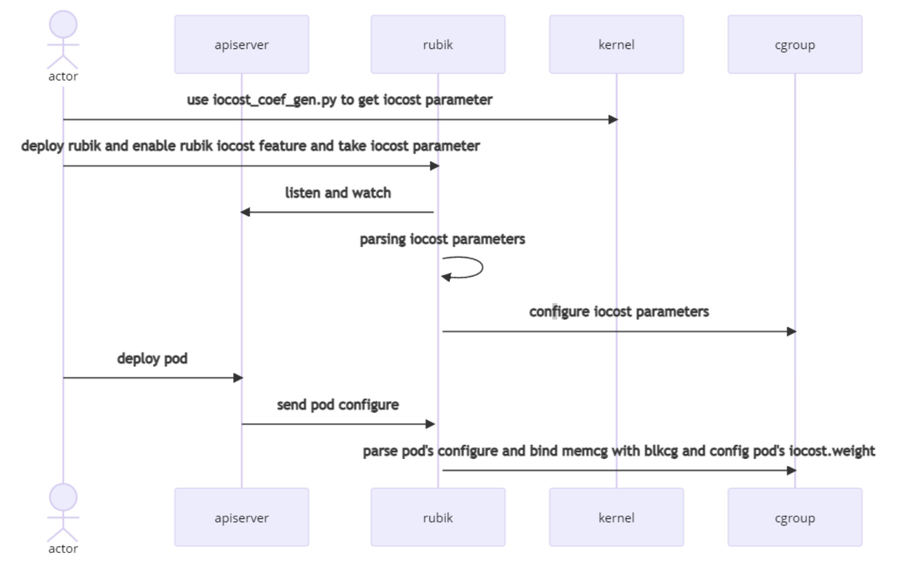

# 特性介绍

## preemption 绝对抢占

rubik支持业务优先级配置，针对在离线业务混合部署的场景，确保在线业务相对离线业务的资源抢占。目前仅支持CPU资源和内存资源。

使用该特性，用户需开启rubik的绝对抢占特性。

```yaml
...
  "agent": {
    "enabledFeatures": [
      "preemption"
    ]
  },
  "preemption": {
    "resource": [
      "cpu",
      "memory"
    ]
  }
...
```

配置参数详见[配置文档](./configuration.md#preemption)。

同时，用户需要在pod的yaml注解中增加`volcano.sh/preemptable`字段来指定业务优先级。业务优先级配置示例如下：

```yaml
annotations:
    volcano.sh/preemptable: true
```

> [!NOTE]说明
>
> 在rubik中，所有特性均通过识别`volcano.sh/preemptable`注解作为业务在离线标志。true代表业务为离线业务，false代表业务为在线业务。

### CPU绝对抢占

针对在离线业务混合部署的场景，确保在线业务相对离线业务的CPU资源抢占。

**前置条件**

- 内核支持针对cgroup的cpu优先级配置，cpu子系统存在接口`cpu.qos_level`。建议使用内核版本openEuler-22.03+。

**内核接口**

- /sys/fs/cgroup/cpu 目录下容器的 cgroup 中，如`/sys/fs/cgroup/cpu/kubepods/burstable/<PodUID>/<container-longid>`目录。
- cpu.qos_level：开启 CPU 优先级配置，默认值为 0， 有效值为 0 和-1。
    - 0：标识为在线业务。
    - -1：标识为离线业务。

### 内存绝对抢占

针对在离线业务混合部署的场景，确保系统内存不足时优先杀死离线业务。

**前置条件**

- 内核支持针对cgroup的memory优先级配置，memory子系统存在接口`memory.qos_level`。建议使用内核版本openEuler-22.03+。
- 开启内存优先级支持: `echo 1 > /proc/sys/vm/memcg_qos_enable`

**内核接口**

- /proc/sys/vm/memcg_qos_enable：开启内存优先级特性，默认值为 0，有效值为 0 和 1。开启命令为：`echo 1 > /proc/sys/vm/memcg_qos_enable`。
    - 0：表示关闭特性。
    - 1：表示开启特性。

- /sys/fs/cgroup/memory 目录下容器的 cgroup 中，如`/sys/fs/cgroup/memory/kubepods/burstable/<PodUID>/<container-longid>`目录
    - memory.qos_level：开启内存优先级配置，默认值为 0，有效值为 0 和-1。
        - 0：标识为在线业务。
        - -1：标识为离线业务。

## dynCache 访存带宽和LLC限制

rubik 支持业务的 Pod 访存带宽(memory bandwidth)和 LLC(Last Level Cache)限制，通过限制离线业务的访存带宽/LLC 使用，减少其对在线业务的干扰。

**前置条件**：

- cache/访存限制功能仅支持物理机，不支持虚拟机。
    - X86 物理机，需要 OS 支持且开启 intel RDT 的 CAT 和 MBA 功能，内核启动项 cmdline 需要添加`rdt=l3cat,mba`
    - ARM 物理机，需要 OS 支持且开启 mpam 功能，内核启动项需要添加`mpam=acpi`。
- 由于内核限制，RDT mode 当前不支持 pseudo-locksetup 模式。
- 用户需手动挂载目录`/sys/fs/resctrl`。 rubik 需要读取和设置`/sys/fs/resctrl` 目录下的文件，该目录需在 rubik 启动前挂载，且需保障在 rubik 运行过程中不被卸载。
- rubik运行依赖SYS_ADMIN权限. 设置主机`/sys/fs/resctrl` 目录下的文件需要 rubik 容器被赋有 SYS_ADMIN 权限。
- rubik 需要获取业务容器进程在主机上的 pid，所以 rubik 容器需与主机共享 pid namespace。

**rubik rdt 控制组**：

rubik 在 RDT resctrl 目录（默认为 /sys/fs/resctrl）下创建 5 个控制组，分别为 rubik_max、rubik_high、rubik_middle、rubik_low、rubik_dynamic。rubik 启动后，将水位线写入对应控制组的 schemata。其中，low、middle、high 的水位线可在 dynCache 中配置；max 控制组为默认最大值，dynamic 控制组初始水位线和 low 控制组一致。

**rubik dynamic 控制组**：

当存在 level 为 dynamic 的离线 Pod 时，rubik 通过采集当前节点在线业务 Pod 的 cache miss 和 llc miss 指标，调整 rubik_dynamic 控制组的水位线，实现对 dynamic 控制组内离线应用 Pod 的动态控制。

### 为Pod设置访存带宽和LLC限制

rubik支持两种方式为业务Pod配置访存带宽和LLC控制组：

- 全局方式
  用户可在rubik的全局参数中配置`defaultLimitMode`字段，rubik会自动为离线业务Pod（即绝对抢占特性中的注解`volcano.sh/preemptable`）配置控制组。
    - 取值为`static`时，pod将被加入到`rubik_max`控制组。
    - 取值为`dynamic`时，pod将被加入到`rubik_dynamic`控制组。

- 手动指定
  用户可手动通过为业务Pod增加注解`volcano.sh/cache-limit`设置其 cache level, 并被加入到指定的控制组中。如下列配置的pod将被加入rubik_low控制组:

  ```yaml
  annotations:
      volcano.sh/cache-limit: "low"
  ```

> [!NOTE]说明
>
> - cache限制只针对离线业务。
>
> - 手动指定注解优先于全局方式。即，若用户在rubik的全局参数中配置了`defaultLimitMode`字段，并且在业务 Pod yaml 中指定了cache level，则dynCache限制将以Pod yaml中的注解为准。

### dynCache 内核接口

- /sys/fs/resctrl: 在该目录下创建 5 个控制组目录，并修改其 schemata 和 tasks 文件。

### dynCache 配置详解

dynCache 功能相关的配置如下：

```json
"agent": {
  "enabledFeatures": [
    "dynCache"
   ]
},
"dynCache": {
  "defaultLimitMode": "static",
  "adjustInterval": 1000,
  "perfDuration": 1000,
  "l3Percent": {
  "low": 20,
  "mid": 30,
  "high": 50
  },
  "memBandPercent": {
    "low": 10,
    "mid": 30,
    "high": 50
  }
}
```

配置参数详见[配置文档](./configuration.md#dyncache)。

- l3Percent 和 memBandPercent：

  通过 l3Percent 和 memBandPercent 配置 low, mid, high 控制组的水位线。

  比如当环境的`rdt bitmask=fffff, numa=2`时，rubik_low 的控制组将根据 l3Percent low=20 和 memBandPercent low=10 两个参数，将为/sys/fs/resctrl/rubik_low 控制组配置：

  ```bash
  L3:0=f;1=f
  MB:0=10;1=10
  ```

- defaultLimitMode:

  如果离线 Pod 未指定`volcano.sh/cache-limit`注解，将根据 dynCache 的 defaultLimitMode 来决定 Pod 将被加入哪个控制组。
- adjustInterval:

  dynCache 动态调整 rubik_dynamic 控制组的间隔时间，单位 ms，默认 1000ms。
- perfDuration:

  dynCache 性能 perf 执行时长，单位 ms，默认 1000ms。

### dynCache 注意事项

- dynCache 仅针对离线 Pod，对在线业务不生效。
- 若业务容器运行过程中被手动重启（容器 ID 不变但容器进程 PID 变化），针对该容器的 dynCache 无法生效。
- 业务容器启动并已设置 dynCache 级别后，不支持对其限制级别进行修改。
- 动态限制组的调控灵敏度受到 rubik 配置文件内 adjustInterval、perfDuration 值以及节点在线业务 Pod 数量的影响，每次调整（若干扰检测结果为需要调整）间隔在区间[adjustInterval+perfDuration, adjustInterval+perfDuration*Pod 数量]内波动，用户可根据灵敏度需求调整配置项。

## dynMemory 内存异步分级回收

rubik 中支持多种内存策略。针对不同场景使用不同的内存分配方案，以解决多场景内存分配。目前仅支持fssr策略。

### fssr 策略

fssr策略是基于内核 cgroup 的动态水位线快压制慢恢复策略。memory.high 是内核提供的 memcg 级的水位线接口，rubik 动态检测内存压力，动态调整离线应用的 memory.high 上限，实现对离线业务的内存压制，保障在线业务的服务质量。

其核心为：

- rubik启动时计算预留内存，默认为总内存的10%，如果总内存的10%超过10G，则为10G。
- 配置离线容器的cgroup级别水位线，内核提供`memory.high`和`memory.high_async_ratio`两个接口，分别配置cgroup的软上限和警戒水位线。启动rubik时默认配置`memory.high`为`total_memory`(总内存)`*`80%。
- 获取剩余内存free_memory。
- free_memory小于预留内存reserved_memory时降低离线的memory.high，每次降低总内存的10%,total_memory`*`10%。
- 持续一分钟free_memory>2`*`reserved_memory时提高离线的memory.high，每次提升总内存的1%，total_memory`*`1%。

**内核接口**

- memory.high

### dynMemory 配置详解

rubik 提供 dynMemory 的指定策略，在`dynMemory`中

```json
"dynMemory": {
    "policy": "fssr"
}
```

- policy 为 memory 的策略名称，支持 fssr 选项。

## 支持弹性限流

为有效解决由业务CPU限流导致QoS下降的问题，rubik容器提供了弹性限流功能，允许容器使用额外的CPU资源，从而保证业务的平稳运行。弹性限流方案包括内核态和用户态配置两种。二者不可同时使用。

用户态通过Linux内核提供的`CFS bandwidth control`能力实现，在保障整机负载水位安全稳定及不影响其他业务运行的前提下，通过双水位机制允许业务容器自适应调整CPU限制，缓解CPU资源瓶颈，提高业务的运行性能。

内核态通过Linux内核提供的`CPU burst`能力，允许容器短时间内突破其cpu使用限制。内核态配置需要用户手动设置和修改每个pod的burst值的大小，rubik不作自适应调整。

### quotaTurbo 用户态解决方案

用户手动为需要自适应调整CPU限额的业务Pod指定“volcano.sh/quota-turbo="true"”注解，（仅针对限额Pod生效，即yaml中指定CPULimit）。
弹性限流用户态策略根据当前整机CPU负载和容器运行情况定时调整白名单容器的CPU quota，并在启停rubik时自动检验并恢复全部容器的quota值 （本节描述的CPU quota指容器当前的cpu.cfs_quota_us参数）。调整策略包括：

1. 整机CPU负载低于警戒水位时，若白名单容器在当前周期受到CPU压制，则rubik按照压制情况缓慢提升容器CPU quota。单轮容器Quota提升总量最多不超过当前节点总CPU quota的1%。
2. 整机CPU负载高于高水位时，若白名单容器在当前周期未受到CPU压制，则rubik依据水位慢速回调容器quota值。
3. 整机CPU负载高于警戒水位时，若白名单容器当前Quota值超过配置值，则rubik快速回落所有容器CPU quota值，尽力保证负载低于警戒水位。
4. 容器最大可调整CPU quota不超过2倍用户配置值（例如Pod yaml中指定CPUlimit参数），但不应小于用户配置值。
5. 容器在60个同步间隔时间内的整体CPU利用率不得超过用户配置值。
6. 若节点在1分钟内整体 CPU 利用率超过10%，则本轮不提升容器配额。

**内核接口**

/sys/fs/cgroup/cpu 目录下容器的 cgroup 中，如`/sys/fs/cgroup/cpu,cpuacct/kubepods/burstable/<PodUID>/<container-longid>`目录，涉及下列文件中：

- cpu.cfs_quota_us
- cpu.cfs_period_us
- cpu.stat

#### quotaTurbo配置详解

quotaTurbo 功能相关的配置如下：

```json
"agent": {
    "enabledFeatures": [
      "quotaTurbo"
    ]
  },
"quotaTurbo": {
    "highWaterMark": 60,
    "alarmWaterMark": 80,
    "syncInterval": 100
}
```

配置参数详见[配置文档](./configuration.md#quotaturbo)。

- highWaterMark是CPU负载的高水位值。
- alarmWaterMark是CPU负载的警戒水位值。
- syncInterval是触发容器quota值更新的间隔（单位：毫秒）。

用户手动为需要业务Pod指定`volcano.sh/quota-turbo="true"`注解。示例如下：

```yaml
metadata:
  annotations:
    # true表示列入quotaturbo特性的白名单中
    volcano.sh/quota-turbo : "true"
```

### quotaBurst 内核态解决方案

quotaBurst通过配置容器的`cpu.cfs_burst_us`内核接口，允许容器在其 cpu 使用量低于 quota 时累积 cpu 资源，并在 cpu 使用量超过 quota 时，使用容器累积的 cpu 资源。

**内核接口**

/sys/fs/cgroup/cpu 目录下容器的 cgroup 中，如`/sys/fs/cgroup/cpu/kubepods/burstable/<PodUID>/<container-longid>`目录，注解的值将被写入下列文件中：

- cpu.cfs_burst_us

> [!NOTE]说明
>
> 内核态通过内核接口cpu.cfs_burst_us实现。支持内核态配置需要确认cgroup的cpu子系统目录下存在cpu.cfs_burst_us文件，其值约束如下：
>
> - 当cpu.cfs_quota_us的值不为-1时，需满足cfs_burst_us + cfs_quota_us <= $2^{44}$-1 且 cfs_burst_us <= cfs_quota_us。
> - 当cpu.cfs_quota_us的值为-1时，CPU burst功能不生效，cfs_burst_us默认为0，不支持配置其他任何值。

#### quotaBurst配置详解

quotaBurst 功能相关的配置如下：

```json
"agent": {
  "enabledFeatures": [
    "quotaBurst"
  ]
}
```

用户手动为需要业务Pod指定`volcano.sh/quota-burst-time`注解，或者在 Pod 运行期间通过 kubectl annotate 进行动态的修改。

- 创建时：在 yaml 文件中

  ```yaml
  metadata:
    annotations:
      # 默认单位是 microseconds
      volcano.sh/quota-burst-time : "2000"
  ```

- 修改注解: 可通过 kubectl annotate 动态修改，如：

  ```bash
  kubectl annotate --overwrite pods <podname> volcano.sh/quota-burst-time='3000'
  ```

### 约束限制

- 用户态通过CFS bandwidth control调整cpu.cfs_period_us和cpu.cfs_quota_us参数实现CPU带宽控制。因此用户态约束如下：
    - 禁止第三方更改CFS bandwidth control相关参数（包括但不限于cpu.cfs_quota_us、cpu.cfs_period_us等文件），以避免未知错误。
    - 禁止与具有限制CPU资源功能的同类产品同时使用，否则导致用户态功能无法正常使用。
    - 若用户监控CFS bandwidth control相关指标，使用本特性可能会破坏监测指标的一致性。
- 内核态约束如下：
    - 用户应使用k8s接口设置pod的busrt值，禁止用户手动直接修改容器的cpu cgroup目录下的cpu.cfs_burst_us文件。
- 禁止用户同时使能弹性限流用户态和内核态方案。

## ioCost 支持iocost对IO权重控制

为了有效解决由离线业务IO占用过高，导致在线业务QoS下降的问题，rubik容器提供了基于cgroup v1 iocost的IO权重控制功能。
资料参见：
[iocost内核相关功能介绍](https://www.kernel.org/doc/html/latest/admin-guide/cgroup-v2.html#io:~:text=correct%20memory%20ownership.-,IO,-%C2%B6)。

**前置条件**

rubik 支持通过在 cgroup v1 下的 iocost 控制不同 Pod 的 io 权重分配。因此需要内核支持如下特性：

- 内核支持 cgroup v1 blkcg iocost
- 内核支持 cgroup v1 writeback

即在 blkcg 根系统文件下存在`blkio.cost.qos`和`blkio.cost.model`两个文件接口。实现方式和接口说明可以访问 openEuler 内核文档。

### ioCost实现说明



步骤如下：

- 部署 rubik 时，rubik 解析配置并设置 iocost 相关参数。
- rubik 注册检测事件到 k8s api-server。
- Pod 被部署时将 Pod 配置信息等回调到 rubik。
- rubik 解析 Pod 配置信息，并根据 qos level 配置 Pod iocost 权重。

### ioCost配置说明

```json
"agent": {
  "enabledFeatures": [
    "ioCost"
  ]
}
"ioCost": [{
  "nodeName": "k8s-single",
  "config": [
    {
      "dev": "sdb",
      "enable": true,
      "model": "linear",
      "param": {
        "rbps": 10000000,
        "rseqiops": 10000000,
        "rrandiops": 10000000,
        "wbps": 10000000,
        "wseqiops": 10000000,
        "wrandiops": 10000000
      }
    }
  ]
}]
```

配置参数详见[配置文档](./configuration.md#iocost)。

> [!NOTE]说明
>
> iocost linear 模型相关参数可以通过 iocost_coef_gen.py 脚本获取，可以从[此链接](https://github.com/torvalds/linux/blob/master/tools/cgroup/iocost_coef_gen.py)获得。

## PSI 支持基于PSI指标的干扰检测

rubik支持观察在线Pod的PSI指标判断当前在线业务的压力，并通过驱逐离线Pod、日志告警等手段预警。rubik以`some avg10`作为指标。它表示任一任务在10s内的平均阻塞时间占比。用户可按需选择对CPU、内存、IO资源进行监测，并设置相应阈值。若阻塞占比超过该阈值，则rubik按照一定策略驱逐离线Pod，释放相应资源。若在线Pod的CPU和内存利用率偏高，rubik会驱逐当前占用CPU资源/内存资源最多的离线业务。若离线业务I/O高，则会选择驱逐CPU资源占用最多的离线业务。

在离线业务由注解`volcano.sh/preemptable="true"/"false"`标识。

```yaml
annotations:
    volcano.sh/preemptable: true
```

**前置条件**

rubik 依赖于 cgroup v1 下的 psi 特性。openEuler 2203及以上版本支持psi cgroup v1接口。
通过如下方法查看当前内核是否开启cgroup v1的psi接口：

```bash
cat /proc/cmdline | grep "psi=1 psi_v1=1"
```

若无，则为内核启动命令行新增参数：

```bash
# 查看内核版本号
uname -a
# 配置内核的boot文件
grubby --update-kernel="$(grubby --default-kernel)" --args="psi=1 psi_v1=1"
# 重启
reboot
```

**内核接口**

/sys/fs/cgroup/cpuacct 目录下容器的 cgroup 中，如`/sys/fs/cgroup/cpu,cpuacct/kubepods/burstable/<PodUID>/<container-longid>`目录，涉及下列文件中：

- cpu.pressure
- memory.pressure
- io.pressure

### psi配置说明

```json
"agent": {
  "enabledFeatures": [
    "psi"
  ]
}
"psi": {
    "interval": 10,
    "resource": [
      "cpu",
      "memory",
      "io"
    ],
    "avg10Threshold": 5.0
}
```

配置参数详见[配置文档](./configuration.md#psi)。

## CPU驱逐水位线控制

rubik支持通过根据节点CPU利用率驱逐离线Pod从而避免节点CPU资源过载。用户可以配置CPU驱逐水位线，rubik会统计指定窗口期间节点的平均CPU利用率。若窗口期内平均CPU利用率大于CPU驱逐水位线，则rubik则驱逐资源利用率高且运行时间较短的离线Pod，释放相应资源。

> [!NOTE]说明
>
> 在离线业务由注解`volcano.sh/preemptable="true"/"false"`标识。
>
> ```yaml
>  annotations:
>      volcano.sh/preemptable: true
>  ```

**配置说明**

```json
{
  "agent": {
    "enabledFeatures": [
      "cpuevict"
    ]
  }
  "cpuevict": {
    "threshold": 60,
    "interval": 1,
    "windows": 2,
    "cooldown": 20
  }
}
```

配置参数详见[配置文档](./configuration.md#cpu驱逐水位线控制)。

## 内存驱逐水位线控制

rubik支持通过根据节点内存利用率驱逐离线Pod从而避免节点内存资源过载。用户可以配置内存驱逐水位线。若节点内存利用率大于内存驱逐水位线，则rubik则驱逐资源利用率高且运行时间较短的离线Pod，释放相应资源。

> [!NOTE]说明
>
> 在离线业务由注解`volcano.sh/preemptable="true"/"false"`标识。
>
> ```yaml
>  annotations:
>      volcano.sh/preemptable: true
>  ```

**配置说明**

```json
{
  "agent": {
    "enabledFeatures": [
      "memoryevict"
    ]
  }
  "memoryevict": {
    "threshold": 60,
    "interval": 1,
    "cooldown": 4
  }
}
```

配置参数详见[配置文档](./configuration.md#内存驱逐水位线控制)。
