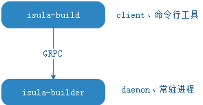

# 容器镜像构建

isula-build是iSula容器团队推出的容器镜像构建工具，支持通过Dockerfile文件快速构建容器镜像。

isula-build采用服务端/客户端模式。其中，isula-build为客户端，提供了一组命令行工具，用于镜像构建及管理等；isula-builder为服务端，用于处理客户端管理请求，作为守护进程常驻后台。

> [!NOTE]说明
>
> isula-build当前支持OCI镜像格式（[OCI Image Format Specification](https://github.com/opencontainers/image-spec/blob/main/spec.md/)）以及Docker镜像格式（Image Manifest Version 2, Schema 2）。通过命令`export ISULABUILD_CLI_EXPERIMENTAL=enabled`开启实验特性以支持OCI镜像格式。不开启实验特性时，isula-build默认采用Docker镜像格式；当开启实验特性后，将默认采用OCI镜像格式。
